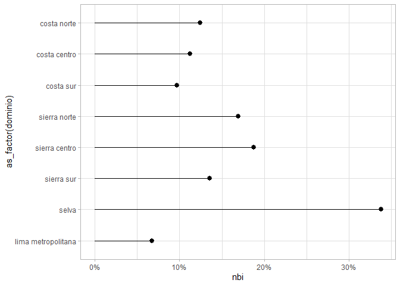

Análisis socioeconómico aplicado a la ENAHO
================
Josue Benites - Dirección Económica CPEI

# Información general

## Sobre la fuente de datos

Los datos a utilizar serán recolectados del [portal de Microdatos del
INEI](http://iinei.inei.gob.pe/microdatos/). Seleccionaremos la Encuesta
Nacional de Hogares (ENAHO) para los diversos módulos de los periodos
2018-2020. 

``` r
options(scipen=999)
```

``` r
setwd("E:/GITHUB/TALLER_PILOTO_CPEI/ANALISIS_SOCIECONOMICO")
inputs<-"inputs/"
```

``` r
library(haven)
library(dplyr)
```

    ## 
    ## Attaching package: 'dplyr'

    ## The following objects are masked from 'package:stats':
    ## 
    ##     filter, lag

    ## The following objects are masked from 'package:base':
    ## 
    ##     intersect, setdiff, setequal, union

``` r
library(reshape2)
library(scales)
library(ggplot2)
library(weights)
```

    ## Loading required package: Hmisc

    ## Loading required package: lattice

    ## Loading required package: survival

    ## Loading required package: Formula

    ## 
    ## Attaching package: 'Hmisc'

    ## The following objects are masked from 'package:dplyr':
    ## 
    ##     src, summarize

    ## The following objects are masked from 'package:base':
    ## 
    ##     format.pval, units

``` r
library(Hmisc)
```

``` r
mod100<-haven::read_dta(paste0(inputs,"enaho01-2019-100.dta"))
```

``` r
head(mod100)
```

    ## # A tibble: 6 x 323
    ##   aÑo   mes   nconglome conglome vivienda hogar ubigeo  dominio  estrato periodo
    ##   <chr> <chr> <chr>     <chr>    <chr>    <chr> <chr>  <dbl+lb> <dbl+lb>   <dbl>
    ## 1 2019  10    007060    005001   007      11    010101 4 [sier~ 4 [ de ~       1
    ## 2 2019  10    007060    005001   017      11    010101 4 [sier~ 4 [ de ~       1
    ## 3 2019  10    007060    005001   028      11    010101 4 [sier~ 4 [ de ~       1
    ## 4 2019  10    007060    005001   040      11    010101 4 [sier~ 4 [ de ~       1
    ## 5 2019  10    007060    005001   050      11    010101 4 [sier~ 4 [ de ~       1
    ## 6 2019  10    007060    005001   061      11    010101 4 [sier~ 4 [ de ~       1
    ## # ... with 313 more variables: tipenc <dbl+lbl>, fecent <dbl>,
    ## #   result <dbl+lbl>, panel <dbl+lbl>, p22 <dbl+lbl>, p23 <chr>,
    ## #   p24a <dbl+lbl>, p24b <dbl+lbl>, p25_1 <dbl+lbl>, p25_2 <dbl+lbl>,
    ## #   p25_3 <dbl+lbl>, p25_4 <dbl+lbl>, p25_5 <dbl+lbl>, p101 <dbl+lbl>,
    ## #   p102 <dbl+lbl>, p103 <dbl+lbl>, p103a <dbl+lbl>, p104 <dbl>, p104a <dbl>,
    ## #   p104b1 <dbl+lbl>, p104b2 <dbl+lbl>, p105a <dbl+lbl>, p105b <dbl>,
    ## #   p106 <dbl>, p106a <dbl+lbl>, p106b <dbl+lbl>, p107b1 <dbl+lbl>, ...

``` r
mod100<-mod100%>%
  filter(result<=2)
```

``` r
weights::wpct(mod100$p105a,mod100$factor07)
```

    ##            1            2            3            4            5            6 
    ## 0.0982385233 0.6965215543 0.0417629415 0.0051291962 0.0030605309 0.1546653974 
    ##            7 
    ## 0.0006218564

``` r
mod100%>%
  filter(p105a>0)%>%
  count(aÑo,p105a,wt=factor07)%>%
  mutate(porcentaje=n/sum(n))%>%
  ggplot(aes(y=aÑo,fill=as_factor(p105a),x=porcentaje))+
  scale_x_continuous(labels=scales::percent)+
  geom_col()+coord_flip()+
  labs(title = "Vivienda según tipo", 
       subtitle = "(Distribución porcentual(%))",
       fill = element_blank(), y= element_blank(),x= element_blank())
```

<!-- -->

``` r
mod100%>%
  count(p106,wt=factor07)%>%
  mutate(percent=n/sum(n))%>%
  filter(p106!="")%>%
  ggplot(aes(x=p106,y=n))+
  geom_col()+
  labs(title = "Perú 2019: ¿Cuánto cree que le pagarían de alquiler \nmensual por la vivienda?", subtitle ="(en S/.)", x="Pago de alquiler mensual",y="Frecuencia")+
  scale_y_continuous(labels=scales::comma)+
  scale_x_continuous(breaks=seq(from=0,to=3000,by=500))
```

<!-- -->

``` r
mod100%>%
  mutate(nbi=rowSums(across(contains("nbi")),
                     na.rm = T),
         nbi=if_else(nbi>=3,1,
                     if_else(nbi<3,0,NULL)))%>%
  summarise_at(vars(contains("nbi")),
               ~100*wtd.mean(.,weights = mod100$factor07, na.rm = T))
```

    ## # A tibble: 1 x 6
    ##    nbi1  nbi2  nbi3  nbi4  nbi5   nbi
    ##   <dbl> <dbl> <dbl> <dbl> <dbl> <dbl>
    ## 1  5.58  4.11  6.22 0.457 0.480 0.258

``` r
mod100%>%
  mutate(nbi=rowSums(across(contains("nbi")),
                     na.rm = T),
         nbi=if_else(nbi>=1,1,
                     if_else(nbi<1,0,NULL)))%>%
  summarise_at(
    vars(contains("nbi")),
               ~100*wtd.mean(.,weights = factor07, na.rm = T))
```

    ## # A tibble: 1 x 6
    ##    nbi1  nbi2  nbi3  nbi4  nbi5   nbi
    ##   <dbl> <dbl> <dbl> <dbl> <dbl> <dbl>
    ## 1  5.58  4.11  6.22 0.457 0.480  14.3

``` r
mod100%>%
  mutate(nbi=rowSums(across(contains("nbi")),
                     na.rm = T),
         nbi=if_else(nbi>=1,1,
                     if_else(nbi<1,0,NULL)))%>%
  group_by(dominio)%>%
  dplyr::summarise(nbi=wtd.mean(nbi,weights = factor07, na.rm = T))%>%
  ggplot(aes(y=as_factor(dominio),x=nbi, xmin=0, xmax=nbi))+
  geom_pointrange()+
  scale_x_continuous(labels=scales::percent)+
  scale_y_discrete(limits = rev)+
  theme_light()
```

<!-- -->
