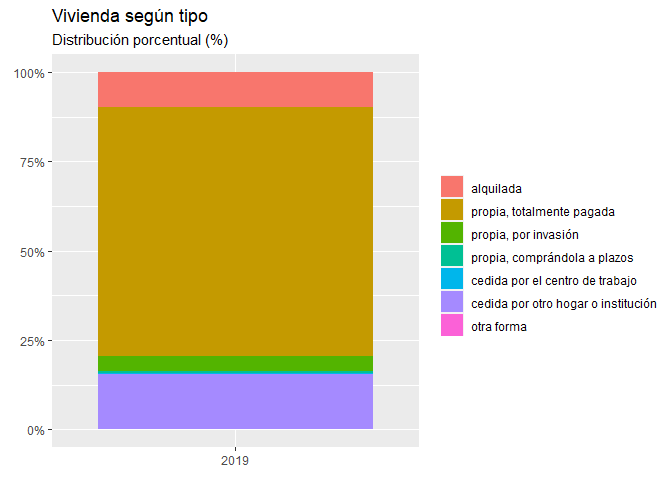

Análisis socioeconómico aplicado a la ENAHO
================
Josue Benites - Dirección Económica CPEI

# Información general

## Sobre la fuente de datos

Los datos a utilizar serán recolectados del [portal de Microdatos del
INEI](http://iinei.inei.gob.pe/microdatos/). Seleccionaremos la Encuesta
Nacional de Hogares (ENAHO) para los diversos módulos de los periodos
2018-2020. 

``` r
#Limpieamos la memoria
rm(list = ls())
#Quitamos los datos en formato científico
options(scipen=999)
#Sitio de trabajo
setwd("E:/GITHUB/TALLER_PILOTO_CPEI/ANALISIS_SOCIECONOMICO")
#Carpeta de trabajo de los datos
inputs<-"inputs/"
```

``` r
library(haven)
library(dplyr)
library(reshape2)
library(scales)
library(ggplot2)
library(weights)
library(Hmisc)
```

# Encuesta Nacional de Hogares

## Características de la Vivienda

``` r
mod100<-haven::read_dta(paste0(inputs,"enaho01-2019-100.dta"))
head(mod100)
```

    ## # A tibble: 6 x 323
    ##   aÑo   mes   nconglome conglome vivienda hogar ubigeo  dominio  estrato periodo
    ##   <chr> <chr> <chr>     <chr>    <chr>    <chr> <chr>  <dbl+lb> <dbl+lb>   <dbl>
    ## 1 2019  10    007060    005001   007      11    010101 4 [sier~ 4 [ de ~       1
    ## 2 2019  10    007060    005001   017      11    010101 4 [sier~ 4 [ de ~       1
    ## 3 2019  10    007060    005001   028      11    010101 4 [sier~ 4 [ de ~       1
    ## 4 2019  10    007060    005001   040      11    010101 4 [sier~ 4 [ de ~       1
    ## 5 2019  10    007060    005001   050      11    010101 4 [sier~ 4 [ de ~       1
    ## 6 2019  10    007060    005001   061      11    010101 4 [sier~ 4 [ de ~       1
    ## # ... with 313 more variables: tipenc <dbl+lbl>, fecent <dbl>,
    ## #   result <dbl+lbl>, panel <dbl+lbl>, p22 <dbl+lbl>, p23 <chr>,
    ## #   p24a <dbl+lbl>, p24b <dbl+lbl>, p25_1 <dbl+lbl>, p25_2 <dbl+lbl>,
    ## #   p25_3 <dbl+lbl>, p25_4 <dbl+lbl>, p25_5 <dbl+lbl>, p101 <dbl+lbl>,
    ## #   p102 <dbl+lbl>, p103 <dbl+lbl>, p103a <dbl+lbl>, p104 <dbl>, p104a <dbl>,
    ## #   p104b1 <dbl+lbl>, p104b2 <dbl+lbl>, p105a <dbl+lbl>, p105b <dbl>,
    ## #   p106 <dbl>, p106a <dbl+lbl>, p106b <dbl+lbl>, p107b1 <dbl+lbl>, ...

COn el comando `dim()` obtenemos el tamaño de la base de datos inicial.

``` r
dim(mod100)
```

    ## [1] 43868   323

Nos quedamos con los datos de los hogares que participaron de la
encuesta con el comando `filter(result<=2)`.

``` r
mod100<-mod100%>%
  filter(result<=2)
```

``` r
mod100<-mod100%>%
  mutate(
    #Creamos la variable zona geográfica
    zona=if_else((dominio>=1 & dominio<=3 ),"Costa",               
                      if_else((dominio>=4 & dominio<=6 ), "Sierra",
                      if_else((dominio==7 ),"Selva",              
                              if_else((dominio==8),"Lima Metropolitana",
                                      #En caso no cumpla con ninguno, NA
                                      NULL)))),
    #Creamos la variable área geográfica
    area=if_else((estrato>=1&estrato<=5),"Urbano",
                 if_else((estrato>=6),"Rural",NULL)),
    #Creamos la zona_INEI
    zona_area=if_else(dominio<8,paste0(zona," ",area),
                      if_else(dominio==8,zona,NULL)),
    #Creamos la variable de ID Departamento
    departamento=substr(ubigeo,1,2))
```

### Tipo de vivienda - Tabla de frecuencia

  - Objetivo: Conocer la distribución de los hogares según el tipo de
    vivienda. Para el año 2019 en el Perú son viviendas propias
    totalmente pagada con un 69.65%.

<!-- end list -->

``` r
weights::wpct(as_factor(mod100$p105a),mod100$factor07)*100
```

    ##                           alquilada           propia, totalmente pagada 
    ##                          9.82385233                         69.65215543 
    ##                propia, por invasión        propia, comprándola a plazos 
    ##                          4.17629415                          0.51291962 
    ##     cedida por el centro de trabajo cedida por otro hogar o institución 
    ##                          0.30605309                         15.46653974 
    ##                          otra forma 
    ##                          0.06218564

``` r
mod100%>%
  filter(p105a>0)%>%
  count(aÑo,p105a,wt=factor07)%>%
  mutate(porcentaje=n/sum(n))%>%
  ggplot(aes(y=aÑo,fill=as_factor(p105a),x=porcentaje))+
  scale_x_continuous(labels=scales::percent)+
  geom_col()+coord_flip()+
  labs(title = "Vivienda según tipo", 
       subtitle = "Distribución porcentual (%)",
       fill = element_blank(), y= element_blank(),x= element_blank())
```

<!-- --> \#\#\# Pago
de alquiler por la vivienda \#\#\#\# Conteo con factor de expansión
¿Cómo se distribuye lo que las personas creen que les pagarían como
alquiler mensual por su vivienda? Con el comando `count(x,wt)` del
paquete `dplyr` obtenemos el conteo ponderado para cada valor para
posteriormente realizar la visualización de los datos.

``` r
mod100%>%
  count(p106,wt=factor07)%>%
  mutate(percent=n/sum(n))%>%
  filter(p106!="")%>%
  ggplot(aes(x=p106,y=n))+
  geom_col()+
  labs(title = "Perú 2019: ¿Cuánto cree que le pagarían de alquiler \nmensual por la vivienda?", subtitle ="(en S/.)", x="Pago de alquiler mensual",y="Frecuencia")+
  scale_y_continuous(labels=scales::comma)+
  scale_x_continuous(breaks=seq(from=0,to=3000,by=500))
```

<!-- --> \#\#\#\#
Cuantiles con factor de expansión

``` r
wtd.quantile(mod100$p106, weights=mod100$factor07, na.rm=T)
```

    ##   0%  25%  50%  75% 100% 
    ##    3   75  200  499 3000

#### Media con factor de expansión

``` r
wtd.mean(mod100$p106, weights=mod100$factor07, na.rm=T)
```

    ## [1] 341.1009

#### Varianza con factor de expansión

``` r
wtd.var(mod100$p106, weights=mod100$factor07, na.rm=T)
```

    ## [1] 172161.4

#### Distribución acumulada con factor de expansión

``` r
wtd.Ecdf(mod100$p106, weights=mod100$factor07, na.rm=T)
```

    ## $x
    ##   [1]    3    3    4    5    6    7    9   10   11   12   13   14   15   16   17
    ##  [16]   18   19   20   22   23   24   25   27   28   29   30   31   32   33   34
    ##  [31]   35   36   37   38   39   40   41   42   43   44   45   46   47   48   49
    ##  [46]   50   51   53   54   55   56   57   58   59   60   62   63   64   65   66
    ##  [61]   67   68   69   70   71   72   73   74   75   76   77   78   79   80   81
    ##  [76]   82   83   84   85   86   87   88   89   90   91   92   93   94   95   96
    ##  [91]   97   98   99  100  101  102  103  104  105  109  110  111  112  113  114
    ## [106]  115  116  117  118  119  120  121  122  123  124  125  126  127  128  129
    ## [121]  130  132  133  135  136  137  138  139  140  141  142  143  144  145  146
    ## [136]  147  148  149  150  151  152  153  154  156  157  158  159  160  161  163
    ## [151]  164  165  166  167  168  169  170  171  172  173  174  175  176  177  178
    ## [166]  179  180  181  182  183  184  185  186  187  188  189  190  191  192  193
    ## [181]  194  195  196  197  198  199  200  201  204  205  208  209  210  213  214
    ## [196]  215  216  218  219  220  222  226  228  229  230  231  232  233  234  235
    ## [211]  236  237  238  239  240  241  242  243  244  245  246  247  248  249  250
    ## [226]  257  259  260  264  265  266  269  270  272  273  274  275  276  277  278
    ## [241]  279  280  281  282  283  284  285  286  287  288  289  290  291  292  293
    ## [256]  294  295  296  297  298  299  300  303  304  308  313  316  319  320  321
    ## [271]  324  328  330  331  332  333  335  336  337  339  340  341  342  343  344
    ## [286]  345  346  347  348  349  350  357  358  359  360  364  366  367  368  369
    ## [301]  370  371  372  373  375  376  377  378  379  380  381  382  383  384  385
    ## [316]  386  387  388  389  390  391  392  393  394  395  396  397  398  399  400
    ## [331]  420  426  428  429  430  432  439  442  443  444  445  446  449  450  453
    ## [346]  460  466  467  468  469  470  471  472  473  474  475  476  477  478  479
    ## [361]  480  481  482  483  484  485  486  487  488  489  490  491  492  493  494
    ## [376]  495  496  497  498  499  500  508  519  529  540  549  550  559  564  567
    ## [391]  570  572  573  574  575  576  578  579  581  582  583  584  585  587  588
    ## [406]  589  592  594  595  596  597  598  599  600  608  614  619  622  640  649
    ## [421]  650  656  662  669  673  674  678  679  680  683  686  687  688  694  695
    ## [436]  697  698  699  700  706  710  720  733  749  750  756  759  761  764  766
    ## [451]  769  781  782  785  788  790  792  795  796  798  799  800  841  849  850
    ## [466]  858  860  870  885  899  900  948  950  953  954  956  964  966  967  972
    ## [481]  977  978  982  985  988  990  994  996  997  998  999 1000 1008 1049 1050
    ## [496] 1100 1147 1149 1199 1200 1250 1299 1300 1399 1400 1415 1423 1425 1439 1499
    ## [511] 1500 1600 1650 1700 1750 1799 1800 1900 1962 1999 2000 2100 2145 2200 2300
    ## [526] 2310 2400 2499 2500 2600 2800 2850 3000
    ## 
    ## $ecdf
    ##   [1] 0.0000000000 0.0000385851 0.0017425678 0.0024868521 0.0025216889
    ##   [6] 0.0025612452 0.0142922786 0.0199157127 0.0199784648 0.0200275495
    ##  [11] 0.0224985699 0.0255225095 0.0274581844 0.0275108954 0.0275439009
    ##  [16] 0.0479319676 0.0586778618 0.0707614079 0.0716474414 0.0734958306
    ##  [21] 0.0745669513 0.0756589517 0.0879271243 0.0972149442 0.1035628103
    ##  [26] 0.1151160616 0.1152079144 0.1155928570 0.1157286620 0.1159749430
    ##  [31] 0.1162053331 0.1197013677 0.1233204309 0.1261677961 0.1288310464
    ##  [36] 0.1335660063 0.1337440834 0.1339411396 0.1340515901 0.1344645439
    ##  [41] 0.1449115899 0.1593540973 0.1715932160 0.1790204418 0.1917458960
    ##  [46] 0.2202972597 0.2203144749 0.2203680769 0.2217925269 0.2246282671
    ##  [51] 0.2269690564 0.2291577804 0.2310979663 0.2337634865 0.2383296403
    ##  [56] 0.2383704937 0.2386259076 0.2390054236 0.2394092364 0.2400918435
    ##  [61] 0.2404509747 0.2408782848 0.2418954209 0.2439437302 0.2439549797
    ##  [66] 0.2449379734 0.2467018713 0.2489218962 0.2510478601 0.2532985958
    ##  [71] 0.2549154551 0.2563772817 0.2589409022 0.2666837744 0.2668521093
    ##  [76] 0.2669594585 0.2673182524 0.2677669530 0.2679580491 0.2681505168
    ##  [81] 0.2682593985 0.2685404522 0.2689467986 0.2713591282 0.2747061592
    ##  [86] 0.2786776923 0.2834776557 0.2889807793 0.2948222582 0.2987186947
    ##  [91] 0.3027973224 0.3076797852 0.3220953927 0.3656105125 0.3657319133
    ##  [96] 0.3657600247 0.3657899797 0.3658137416 0.3658402921 0.3660025633
    ## [101] 0.3663238459 0.3668385417 0.3674515489 0.3679008650 0.3685906225
    ## [106] 0.3689615096 0.3695071146 0.3696836187 0.3702022962 0.3716586184
    ## [111] 0.3763721141 0.3764635375 0.3765209426 0.3766200939 0.3766735521
    ## [116] 0.3767175599 0.3767782091 0.3768091761 0.3768594833 0.3770268774
    ## [121] 0.3774604105 0.3774753511 0.3775665335 0.3776538389 0.3780655925
    ## [126] 0.3788806142 0.3797623546 0.3810101765 0.3833951943 0.3852144345
    ## [131] 0.3880005076 0.3906914183 0.3917643807 0.3937034983 0.3949886239
    ## [136] 0.3969753183 0.3987428456 0.4082257160 0.4400184953 0.4400417854
    ## [141] 0.4401362824 0.4402233437 0.4402636007 0.4403152682 0.4403506783
    ## [146] 0.4404295151 0.4406321200 0.4412799898 0.4413010330 0.4413373684
    ## [151] 0.4413557328 0.4413570960 0.4416013121 0.4416786210 0.4417325905
    ## [156] 0.4418800263 0.4422906861 0.4423511200 0.4425469081 0.4427195838
    ## [161] 0.4428219374 0.4430566982 0.4430953922 0.4432277957 0.4434144766
    ## [166] 0.4443366912 0.4467633346 0.4470445944 0.4473142873 0.4476990607
    ## [171] 0.4482869363 0.4490994619 0.4499904257 0.4512875694 0.4525183242
    ## [176] 0.4546750846 0.4580747834 0.4609052013 0.4620047255 0.4635324959
    ## [181] 0.4654128171 0.4672666564 0.4694777988 0.4713417623 0.4737297034
    ## [186] 0.4895843325 0.5479348155 0.5479737881 0.5480052638 0.5480756691
    ## [191] 0.5482007531 0.5484331523 0.5485991853 0.5486047729 0.5486589942
    ## [196] 0.5486689542 0.5487449686 0.5487601064 0.5487675257 0.5488215397
    ## [201] 0.5488480902 0.5488704618 0.5490536901 0.5491521260 0.5494265894
    ## [206] 0.5495802529 0.5497250512 0.5498426135 0.5503709393 0.5514066968
    ## [211] 0.5517084662 0.5527518817 0.5532002382 0.5544442875 0.5555023795
    ## [216] 0.5556553218 0.5561797621 0.5564202263 0.5567398603 0.5569141700
    ## [221] 0.5574731982 0.5581538699 0.5586021720 0.5639225856 0.5830248214
    ## [226] 0.5830597285 0.5830812280 0.5831364068 0.5831761144 0.5832026947
    ## [231] 0.5832665251 0.5833009409 0.5833395260 0.5833892621 0.5834385522
    ## [236] 0.5835094788 0.5835801455 0.5836613998 0.5838263612 0.5839983569
    ## [241] 0.5843690267 0.5850781291 0.5853498270 0.5859140157 0.5873017228
    ## [246] 0.5882746348 0.5897225092 0.5907516362 0.5916669627 0.5921562967
    ## [251] 0.5928388044 0.5940096837 0.5946764843 0.5955176990 0.5959449588
    ## [256] 0.5971412903 0.5979728490 0.5983952880 0.5996836250 0.6010274899
    ## [261] 0.6149981443 0.6758550019 0.6759988051 0.6760387377 0.6763364567
    ## [266] 0.6763617776 0.6764050628 0.6765744597 0.6770976238 0.6771009209
    ## [271] 0.6771239916 0.6772198652 0.6772798904 0.6774580286 0.6778901397
    ## [276] 0.6780020589 0.6782448844 0.6783184815 0.6786431393 0.6786535550
    ## [281] 0.6786758475 0.6787251920 0.6787808308 0.6788891292 0.6789570031
    ## [286] 0.6792049103 0.6793775819 0.6796121131 0.6796449906 0.6825198313
    ## [291] 0.6931623577 0.6932462291 0.6933279880 0.6934765097 0.6939801898
    ## [296] 0.6939917668 0.6940875436 0.6941078306 0.6941433083 0.6941818934
    ## [301] 0.6942173346 0.6942486442 0.6942709367 0.6943221124 0.6945532936
    ## [306] 0.6948082456 0.6950186738 0.6954802221 0.6956827242 0.6963692642
    ## [311] 0.6967542097 0.6969352832 0.6971873650 0.6972023481 0.6972922301
    ## [316] 0.6974523826 0.6975467850 0.6976540953 0.6980878963 0.6981874336
    ## [321] 0.6982968287 0.6986355505 0.6988432839 0.6989504914 0.6991388977
    ## [326] 0.6996453852 0.6998832530 0.7002634738 0.7080882800 0.7365195895
    ## [331] 0.7365792481 0.7366479158 0.7366775296 0.7367075653 0.7367399222
    ## [336] 0.7367666862 0.7368243160 0.7368591987 0.7368771278 0.7369072628
    ## [341] 0.7369614714 0.7370256859 0.7377874652 0.7426464370 0.7427725385
    ## [346] 0.7427769068 0.7428156071 0.7428291991 0.7428757624 0.7429394671
    ## [351] 0.7429998946 0.7434158793 0.7440182283 0.7441470610 0.7442922676
    ## [356] 0.7445458902 0.7446946316 0.7449982437 0.7453342464 0.7456951011
    ## [361] 0.7460788136 0.7461988993 0.7463502018 0.7465545607 0.7467438966
    ## [366] 0.7467844783 0.7469065853 0.7470289198 0.7470764582 0.7472477933
    ## [371] 0.7474454211 0.7476312692 0.7479289689 0.7481227486 0.7484236333
    ## [376] 0.7487940115 0.7488703227 0.7490681844 0.7493795883 0.7611821778
    ## [381] 0.8171080357 0.8171564567 0.8171888136 0.8173348484 0.8175404756
    ## [386] 0.8176990048 0.8182228484 0.8182332863 0.8182728035 0.8183399462
    ## [391] 0.8183738351 0.8185176383 0.8185363067 0.8186044721 0.8187387764
    ## [396] 0.8189676977 0.8190189995 0.8191132905 0.8191254530 0.8191475885
    ## [401] 0.8191883645 0.8193241526 0.8193820648 0.8195227513 0.8195686864
    ## [406] 0.8195941520 0.8197286035 0.8197568035 0.8197660398 0.8198075632
    ## [411] 0.8199346060 0.8199620089 0.8249779677 0.8535242790 0.8536891939
    ## [416] 0.8538260755 0.8538586660 0.8539141112 0.8540304761 0.8541760603
    ## [421] 0.8556140029 0.8556432948 0.8557893296 0.8558312985 0.8558458615
    ## [426] 0.8558684218 0.8559239872 0.8559243683 0.8560168475 0.8560383259
    ## [431] 0.8561258687 0.8561628619 0.8562508115 0.8562942784 0.8565232693
    ## [436] 0.8566293755 0.8566627941 0.8587481982 0.8738713093 0.8738762646
    ## [441] 0.8739693926 0.8739923579 0.8740436597 0.8742185074 0.8752923546
    ## [446] 0.8754558724 0.8755343728 0.8755710241 0.8755874351 0.8755885374
    ## [451] 0.8757709446 0.8758773403 0.8759378115 0.8759716741 0.8759934571
    ## [456] 0.8760225590 0.8760544061 0.8760819361 0.8761186749 0.8761678048
    ## [461] 0.8798734717 0.9069095950 0.9069394911 0.9069435283 0.9077336331
    ## [466] 0.9077389694 0.9078021475 0.9078229812 0.9078829202 0.9084107316
    ## [471] 0.9133099713 0.9133533240 0.9139692048 0.9140587285 0.9140770495
    ## [476] 0.9141147262 0.9141530732 0.9141696577 0.9141907008 0.9142311627
    ## [481] 0.9142495730 0.9142678738 0.9143325946 0.9143657246 0.9145002794
    ## [486] 0.9145610174 0.9146355005 0.9147311166 0.9147776176 0.9148480086
    ## [491] 0.9190238437 0.9468941816 0.9469759406 0.9470925888 0.9472122356
    ## [496] 0.9477714655 0.9479175003 0.9480518046 0.9484791017 0.9591555106
    ## [501] 0.9593353046 0.9593431423 0.9612952124 0.9613425026 0.9621458749
    ## [506] 0.9621657366 0.9621846393 0.9622815618 0.9624383939 0.9629218932
    ## [511] 0.9805830839 0.9818210030 0.9818769090 0.9822792285 0.9824360606
    ## [516] 0.9824407198 0.9845250216 0.9845935434 0.9846704705 0.9849731773
    ## [521] 0.9925544283 0.9927632942 0.9928698234 0.9931296272 0.9933789717
    ## [526] 0.9934397097 0.9941327745 0.9941359973 0.9971196698 0.9971804078
    ## [531] 0.9976048360 0.9976655740 1.0000000000

Combinamos los resultados para obtener el punto de corte de los valores
por debajo de la media(línea vertical) y la mediana(zona de colores).

``` r
as.data.frame(wtd.Ecdf(mod100$p106,
                       weights=mod100$factor07,
                       na.rm=T))%>%
  ggplot(aes(x,ecdf))+
  scale_y_continuous(labels=scales::percent)+
  scale_x_continuous(labels=scales::comma)+
  geom_area(aes(fill=ecdf<=0.5))+
  geom_vline(xintercept = wtd.mean(mod100$p106,
                                   weights=mod100$factor07, na.rm=T),
             col="red", size=1, linetype="dashed")+
  theme_bw()+
  scale_fill_grey()+
  theme(legend.position = "none")+
  labs(x="En Soles (S/.)",y="Distribución acumulada(%)",
       title = "Pago por alquiler mensual 2019")
```

<!-- -->

``` r
as.data.frame(wtd.table(mod100$p106,mod100$factor07), col.names = c("x","freq"))%>%
  ggplot(aes(x,freq))+
  geom_col()+
  scale_y_continuous(labels = scales::comma)
```

<!-- -->

``` r
data.frame(x=wtd.quantile(mod100$p106, weights=mod100$factor07, na.rm=T),pct=seq(0,1,.25), row.names = NULL)
```

    ##      x  pct
    ## 1    3 0.00
    ## 2   75 0.25
    ## 3  200 0.50
    ## 4  499 0.75
    ## 5 3000 1.00

#### Histogramas con factor de expansión

``` r
mod100%>%
  ggplot(aes(x = p106,
             weight = factor07, fill=area))+
  geom_density(position = "stack")+
  labs(x="En Soles(S/.)",subtitle = "Alquiler mensual", 
       title="Perú 2019:Distribución de alquiler según área",
       fill="Área",y="Densidad")
```

    ## Warning: Removed 4085 rows containing non-finite values (stat_density).

<!-- -->

``` r
mod100%>%
  ggplot(aes(x = p106,
             weight = factor07, fill=area)) + geom_histogram()+
  facet_wrap(~area)+
  labs(x=element_blank(),subtitle = "Alquiler mensual en Soles (S/.)", 
       title="Perú 2019:Distribución de alquiler según área",
       y="Frecuencia")+
  theme(legend.position = "none")
```

    ## `stat_bin()` using `bins = 30`. Pick better value with `binwidth`.

    ## Warning: Removed 4085 rows containing non-finite values (stat_bin).

<!-- -->

``` r
mod100%>%
  ggplot(aes(x = p106, y = ..density..,
             weight = factor07, fill=area)) + geom_histogram()+
  facet_wrap(~area, scales = "free_y")+
  labs(x=element_blank(),subtitle = "Alquiler mensual en Soles (S/.)", 
       title="Perú 2019:Distribución de alquiler según área",
       y="Densidad")+
  theme(legend.position = "none")
```

    ## `stat_bin()` using `bins = 30`. Pick better value with `binwidth`.

    ## Warning: Removed 4085 rows containing non-finite values (stat_bin).

<!-- -->

#### Boxplot con factor de expansión

``` r
mod100%>%
ggplot(aes(x = area, y = p106, weight = factor07,fill=area)) + 
  geom_boxplot(width=0.6)+
  scale_y_continuous(labels = scales::comma)+
  coord_flip()+
  theme_bw()+
  theme(legend.position = "none",axis.title.y = element_blank())+
  labs(title="Gráfico de cajas del pago de alquiler 2019",
       y="En Soles (S/.)")
```

    ## Warning: Removed 4085 rows containing non-finite values (stat_boxplot).

<!-- -->

### Cálculo de hogares con privaciones en necesidades básicas insatisfechas

``` r
mod100%>%
  mutate(nbi=rowSums(across(contains("nbi")),
                     na.rm = T),
         nbi=if_else(nbi>=1,1,
                     if_else(nbi<1,0,NULL)))%>%
  summarise_at(vars(contains("nbi")),
               ~wtd.mean(.,weights = mod100$factor07, na.rm = T))
```

    ## # A tibble: 1 x 6
    ##     nbi1   nbi2   nbi3    nbi4    nbi5   nbi
    ##    <dbl>  <dbl>  <dbl>   <dbl>   <dbl> <dbl>
    ## 1 0.0558 0.0411 0.0622 0.00457 0.00480 0.143

Guardamos el valor de nbi final a nivel nacional

``` r
nbiperu<-mod100%>%
  mutate(nbi=rowSums(across(contains("nbi")),
                     na.rm = T),
         nbi=if_else(nbi>=1,1,
                     if_else(nbi<1,0,NULL)))%>%
  summarise_at(vars(contains("nbi")),
               ~wtd.mean(.,weights = mod100$factor07, na.rm = T))%>%
  select(nbi)
```

``` r
mod100%>%
  mutate(nbi=rowSums(across(contains("nbi")),
                     na.rm = T),
         nbi=if_else(nbi>=1,1,
                     if_else(nbi<1,0,NULL)))%>%
  group_by(dominio)%>%
  dplyr::summarise(nbi=wtd.mean(nbi,weights = factor07, na.rm = T))%>%
  ggplot(aes(y=as_factor(dominio),x=nbi, xmin=0, xmax=nbi))+
  geom_pointrange()+
  scale_x_continuous(labels=scales::percent)+
  scale_y_discrete(limits = rev)+
  theme_light()+
  labs(y="Dominio",subtitle= "Porcentaje del total (%)",title = "Hogares con al menos una privación en NBI's 2019",x=element_blank())+
  geom_vline(xintercept = nbiperu$nbi, linetype="dashed", col="blue")
```

<!-- --> \#\#\#
Modulo de Empleo e Ingresos

``` r
mod500<-haven::read_dta(paste0(inputs,"enaho01a-2019-500.dta"))
head(mod500)
```

    ## # A tibble: 6 x 1,355
    ##   aÑo   mes   nconglome conglome vivienda hogar codperso ubigeo  dominio estrato
    ##   <chr> <chr> <chr>     <chr>    <chr>    <chr> <chr>    <chr>  <dbl+lb> <dbl+l>
    ## 1 2019  10    007060    005001   007      11    01       010101 4 [sier~ 4 [ de~
    ## 2 2019  10    007060    005001   007      11    02       010101 4 [sier~ 4 [ de~
    ## 3 2019  10    007060    005001   007      11    03       010101 4 [sier~ 4 [ de~
    ## 4 2019  10    007060    005001   017      11    01       010101 4 [sier~ 4 [ de~
    ## 5 2019  10    007060    005001   017      11    02       010101 4 [sier~ 4 [ de~
    ## 6 2019  10    007060    005001   017      11    03       010101 4 [sier~ 4 [ de~
    ## # ... with 1,345 more variables: codinfor <chr>, p500a <chr>, p500b <chr>,
    ## #   p500b1 <dbl>, p500c <chr>, p500d <chr>, p500d1 <dbl>, p500n <chr>,
    ## #   p500i <chr>, p501 <dbl+lbl>, p502 <dbl+lbl>, p503 <dbl+lbl>,
    ## #   p504 <dbl+lbl>, p5041 <dbl+lbl>, p5042 <dbl+lbl>, p5043 <dbl+lbl>,
    ## #   p5044 <dbl+lbl>, p5045 <dbl+lbl>, p5046 <dbl+lbl>, p5047 <dbl+lbl>,
    ## #   p5048 <dbl+lbl>, p5049 <dbl+lbl>, p50410 <dbl+lbl>, p50411 <dbl+lbl>,
    ## #   p505 <dbl+lbl>, p505r4 <dbl+lbl>, p505b <dbl>, p506 <dbl+lbl>, ...

Al igual que el módulo 100, hay que limpiar la base para realizar el
cálculo de indicadores socioeconómicos. Nos quedamos únicamente con las
personas residentes del hogar que participaron de la encuesta.

``` r
mod500%>%
  #Creamos la variable residente
  mutate(residente=if_else((p204==1 & p205==2), 1, 
                           if_else((p206==1 & p204==2) , 1,
                                   0)))%>%
  #Nos quedamos con los residentes para la estimación de indicadores
  filter(residente==1)
```

    ## # A tibble: 90,677 x 1,356
    ##    aÑo   mes   nconglome conglome vivienda hogar codperso ubigeo dominio estrato
    ##    <chr> <chr> <chr>     <chr>    <chr>    <chr> <chr>    <chr>  <dbl+l> <dbl+l>
    ##  1 2019  10    007060    005001   007      11    01       010101 4 [sie~ 4 [ de~
    ##  2 2019  10    007060    005001   007      11    02       010101 4 [sie~ 4 [ de~
    ##  3 2019  10    007060    005001   017      11    01       010101 4 [sie~ 4 [ de~
    ##  4 2019  10    007060    005001   017      11    02       010101 4 [sie~ 4 [ de~
    ##  5 2019  10    007060    005001   017      11    03       010101 4 [sie~ 4 [ de~
    ##  6 2019  10    007060    005001   017      11    04       010101 4 [sie~ 4 [ de~
    ##  7 2019  10    007060    005001   017      11    05       010101 4 [sie~ 4 [ de~
    ##  8 2019  10    007060    005001   040      11    01       010101 4 [sie~ 4 [ de~
    ##  9 2019  10    007060    005001   040      11    02       010101 4 [sie~ 4 [ de~
    ## 10 2019  10    007060    005001   040      11    03       010101 4 [sie~ 4 [ de~
    ## # ... with 90,667 more rows, and 1,346 more variables: codinfor <chr>,
    ## #   p500a <chr>, p500b <chr>, p500b1 <dbl>, p500c <chr>, p500d <chr>,
    ## #   p500d1 <dbl>, p500n <chr>, p500i <chr>, p501 <dbl+lbl>, p502 <dbl+lbl>,
    ## #   p503 <dbl+lbl>, p504 <dbl+lbl>, p5041 <dbl+lbl>, p5042 <dbl+lbl>,
    ## #   p5043 <dbl+lbl>, p5044 <dbl+lbl>, p5045 <dbl+lbl>, p5046 <dbl+lbl>,
    ## #   p5047 <dbl+lbl>, p5048 <dbl+lbl>, p5049 <dbl+lbl>, p50410 <dbl+lbl>,
    ## #   p50411 <dbl+lbl>, p505 <dbl+lbl>, p505r4 <dbl+lbl>, p505b <dbl>, ...

``` r
mod500<-mod500%>%
    mutate(
    #Creamos la variable zona geográfica
    zona=if_else((dominio>=1 & dominio<=3 ),"Costa",               
                      if_else((dominio>=4 & dominio<=6 ), "Sierra",
                      if_else((dominio==7 ),"Selva",              
                              if_else((dominio==8),"Lima Metropolitana",
                                      #En caso no cumpla con ninguno, NA
                                      NULL)))),
    #Creamos la variable área geográfica
    area=if_else((estrato>=1&estrato<=5),"Urbano",
                 if_else((estrato>=6),"Rural",NULL)),
    #Creamos la zona_INEI
    zona_area=if_else(dominio<8,paste0(zona," ",area),
                      if_else(dominio==8,zona,NULL)),
    #Creamos la variable de ID Departamento
    departamento=substr(ubigeo,1,2))
```

Creamos las variables para el cálculo socioeconómico: informalidad, PEA,
PEA ocupada,

``` r
mod500<-mod500%>% 
  #Variables a utilizar para informalidad
  mutate(
    #Creamos variable PEA
    pea=if_else((ocu500>=1 & ocu500<=3),1,NULL),
    #Creamos variable PEA Ocupada
    pea_ocu=if_else((ocu500==1),1,NULL),
    #Creamos la variable informal: 1 si lo es ; 0 si es formal
    informal=if_else(( ocupinf==1 & pea_ocu==1),1, 
                          if_else(( ocupinf==2 & pea_ocu==1),0, NULL)),
    desempleo=if_else(pea==1&ocu500==2,1, if_else(ocu500<=3,0,NULL)))
```

``` r
inf_des<-mod500%>%
  group_by(departamento)%>%
  dplyr::summarise(informal=100*wtd.mean(informal,w=fac500a, na.rm = T),
                   desempleo=100*wtd.mean(desempleo,w=fac500a, na.rm = T))
head(inf_des)
```

    ## # A tibble: 6 x 3
    ##   departamento informal desempleo
    ##   <chr>           <dbl>     <dbl>
    ## 1 01               86.4     0.984
    ## 2 02               78.5     2.46 
    ## 3 03               85.4     2.27 
    ## 4 04               66.2     3.33 
    ## 5 05               87.0     2.21 
    ## 6 06               87.9     2.33

Creamos ID departamentales

``` r
regiones<-data.frame(
  # Del 1 al 25
  id= c(01:25),
  # Asignamos los nombres de los departamentos
  departamentos=c("Amazonas", "Ancash", "Apurimac", "Arequipa", "Ayacucho", "Cajamarca", "Callao", "Cusco", "Huancavelica", "Huanuco", "Ica","Junin", "La Libertad","Lambayeque", "Lima", "Loreto", "Madre De Dios", "Moquegua", "Pasco", "Piura", "Puno" , "San Martin", "Tacna" , "Tumbes" , "Ucayali")
  )%>%
  #Generamos los ID departamentales para el posterior emparejamiento
  mutate(id=if_else(id<10,paste0("0",id),paste0(id)))
```

``` r
data19<-inf_des%>%
  left_join(regiones, by=c("departamento"="id"))
```

``` r
data19%>%
  ggplot(aes(informal,desempleo))+geom_point()
```

<!-- -->

``` r
library(ggpubr)
```

    ## Warning: package 'ggpubr' was built under R version 4.0.5

``` r
ggscatter(data19, x = "desempleo", y = "informal", add = "reg.line") +
  stat_cor(label.y = 58) +
  stat_regline_equation(label.y = 55)+
  labs(x="Desempleo",y="Informalidad", title = "¿Relación entre iformalidad y desempleo?")
```

    ## `geom_smooth()` using formula 'y ~ x'

<!-- -->

``` r
ggscatter(data19, x="desempleo", y="informal", add = "reg.line") +
  stat_cor(label.y = 60, 
           aes(label = paste(..rr.label.., ..p.label.., sep = "~`,`~")))+
  labs(x="Desempleo",y="Informalidad", title = "¿Relación entre iformalidad y desempleo?")
```

    ## `geom_smooth()` using formula 'y ~ x'

<!-- --> \#\#\#
Módulo sumaria

``` r
sumaria<-haven::read_dta(paste0(inputs,"sumaria-2019.dta"))
```

``` r
sumaria<-sumaria%>%
  select(aÑo : estrato, pobreza, mieperho, factor07, inghog2d,gashog2d)%>%
  mutate(factorp=mieperho*factor07, 
         ing_pc=(inghog2d/(mieperho*12)),
         gasto_pc=(gashog2d/(mieperho*12)),
         pobre=if_else(pobreza<=2,1,
                           if_else(pobreza==3,0,NULL)))
```

``` r
sumaria<-sumaria%>%
  mutate(
    #Creamos la variable zona geográfica
    zona=if_else((dominio>=1 & dominio<=3 ),"Costa",               
                      if_else((dominio>=4 & dominio<=6 ), "Sierra",
                      if_else((dominio==7 ),"Selva",              
                              if_else((dominio==8),"Lima Metropolitana",
                                      #En caso no cumpla con ninguno, NA
                                      NULL)))),
    #Creamos la variable área geográfica
    area=if_else((estrato>=1&estrato<=5),"Urbano",
                 if_else((estrato>=6),"Rural",NULL)),
    #Creamos la zona_INEI
    zona_area=if_else(dominio<8,paste0(zona," ",area),
                      if_else(dominio==8,zona,NULL)),
    #Creamos la variable de ID Departamento
    departamento=substr(ubigeo,1,2))
```

``` r
sumaria%>%
  group_by(area)%>%
  dplyr::summarise(ingreso=wtd.mean(ing_pc,factorp,na.rm = T),
                   gasto=wtd.mean(gasto_pc,factorp,na.rm = T),
                   consumo=gasto/ingreso,
                   pobreza=100*wtd.mean(pobre,factorp,na.rm = T))
```

    ## # A tibble: 2 x 5
    ##   area   ingreso gasto consumo pobreza
    ##   <chr>    <dbl> <dbl>   <dbl>   <dbl>
    ## 1 Rural     409.  343.   0.839    40.8
    ## 2 Urbano   1000.  790.   0.790    14.6
