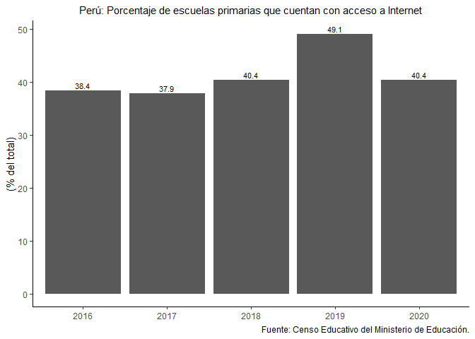
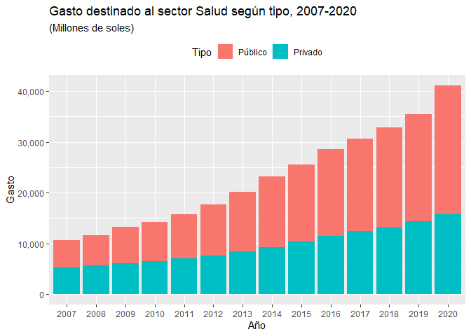
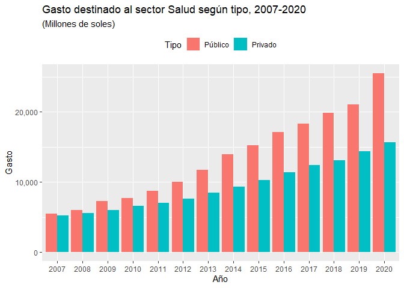
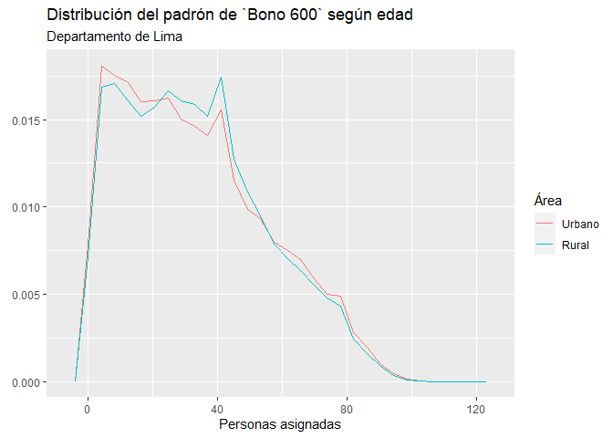
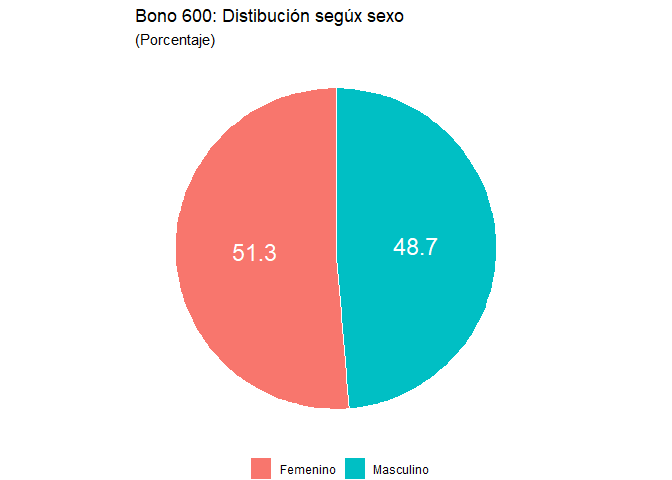

Visualización de datos en R
================

# Introducción

Los paquetes a utilizar son los siguientes:

``` r
library(readxl) #Leer formato xls, xlsx
library(readr) #Leer csv, tsv
library(archive) #Leer zip
library(dplyr) #Manipulación de datos
```

    ## 
    ## Attaching package: 'dplyr'

    ## The following objects are masked from 'package:stats':
    ## 
    ##     filter, lag

    ## The following objects are masked from 'package:base':
    ## 
    ##     intersect, setdiff, setequal, union

``` r
library(reshape2) #Pivot y unpivot datos
library(ggplot2) #Visualización de datos
library(scales) #Convertir números a determinadas escalas
```

    ## 
    ## Attaching package: 'scales'

    ## The following object is masked from 'package:readr':
    ## 
    ##     col_factor

## Gráfico de barras

Para los gráficos de barras utilizaremos datos de [ESCALE
Minedu](http://escale.minedu.gob.pe/ueetendencias2016) de la serie de
*Acceso a TIC* .

Descargamos los datos de la
[tabla](http://escale.minedu.gob.pe/ueetendencias2016?p_auth=gY0rvgyy&p_p_id=TendenciasActualPortlet2016_WAR_tendencias2016portlet_INSTANCE_t6xG&p_p_lifecycle=1&p_p_state=normal&p_p_mode=view&p_p_col_id=column-1&p_p_col_pos=1&p_p_col_count=3&_TendenciasActualPortlet2016_WAR_tendencias2016portlet_INSTANCE_t6xG_idCuadro=52)
en el formato de nuestro interés con el comando `download.file()`

``` r
td1 <- tempdir()
```

Cargamos los datos para los departamentos. Con la opción `skip` damos el
salto a donde inician los datos de nuestro interés. Además, cambiamos el
nombre de los datos

``` r
download.file("http://escale.minedu.gob.pe/tendencias-2016-portlet/servlet/tendencias/archivo?idCuadro=52&tipo=excel",
              destfile=paste0(td1,"/","acceso_internet.xls"),
              mode='wb')
acceso_tic<-read_xls(paste0(td1,"/","acceso_internet.xls"), skip=11)%>%
  filter(...2!="" & Región!="")
#Renombramos las columnas
names(acceso_tic)<-c("Región", 2016:2020)
#View de los datos
head(acceso_tic)
```

    ## # A tibble: 6 x 6
    ##   Región    `2016` `2017` `2018` `2019`             `2020`
    ##   <chr>      <dbl>  <dbl>  <dbl> <chr>               <dbl>
    ## 1 Amazonas    11.1   10.1   11.5 21.098039215686274   10.2
    ## 2 Ancash      35.8   34.4   37.4 49.947033898305079   37.3
    ## 3 Apurímac    23.3   23.3   27.1 48.168701442841289   34.6
    ## 4 Arequipa    57.5   57.7   63.0 66.06236403190718    61.9
    ## 5 Ayacucho    24.7   21.6   27.3 46.977067407922171   36.1
    ## 6 Cajamarca   23.0   21.6   21.6 37.065534624568855   18.8

Con el comando `summary` obtenemos información estadística de la base de
datos. Hay un problema en la columna del año 2019, pues la asigna como
carácter.

``` r
summary(acceso_tic)
```

    ##     Región               2016            2017            2018      
    ##  Length:26          Min.   :11.07   Min.   :10.13   Min.   :11.48  
    ##  Class :character   1st Qu.:23.16   1st Qu.:22.02   1st Qu.:24.07  
    ##  Mode  :character   Median :33.25   Median :32.31   Median :33.78  
    ##                     Mean   :38.89   Mean   :38.30   Mean   :40.88  
    ##                     3rd Qu.:54.75   3rd Qu.:54.72   3rd Qu.:59.47  
    ##                     Max.   :80.82   Max.   :81.55   Max.   :88.27  
    ##      2019                2020      
    ##  Length:26          Min.   :10.19  
    ##  Class :character   1st Qu.:26.51  
    ##  Mode  :character   Median :36.28  
    ##                     Mean   :41.05  
    ##                     3rd Qu.:59.00  
    ##                     Max.   :86.46

Aplicamos el comando `as.numeric` para convertir el carácter a número.

``` r
acceso_tic$`2019`<-as.numeric(acceso_tic$`2019`)
head(acceso_tic) # Muestra los primeros datos de la base
```

    ## # A tibble: 6 x 6
    ##   Región    `2016` `2017` `2018` `2019` `2020`
    ##   <chr>      <dbl>  <dbl>  <dbl>  <dbl>  <dbl>
    ## 1 Amazonas    11.1   10.1   11.5   21.1   10.2
    ## 2 Ancash      35.8   34.4   37.4   49.9   37.3
    ## 3 Apurímac    23.3   23.3   27.1   48.2   34.6
    ## 4 Arequipa    57.5   57.7   63.0   66.1   61.9
    ## 5 Ayacucho    24.7   21.6   27.3   47.0   36.1
    ## 6 Cajamarca   23.0   21.6   21.6   37.1   18.8

## Barrras horizontales

Con el comando `scale_y_discrete(limits=rev)` logramos ordenar los
departamentos de manera alfabética.

``` r
acceso_tic%>%
  ggplot(aes(y=Región, x=`2020`))+
  geom_col()+
  scale_y_discrete(limits = rev)+
  labs(x="(% del total)",caption="Fuente: Censo Educativo del Ministerio de Educación.", title="Perú: Porcentaje de escuelas primarias que cuentan con acceso a Internet\n según departamento, 2020")+
  theme_classic()+
  theme(axis.title.y = element_blank(),
        plot.title = element_text(hjust = 0.5, size=09),
        axis.text.y = element_text(size=08))
```

<!-- -->

¿Cómo ordenar a modo ránking? Utilizamos la función
`reorder(Región,`2020`)` para que el eje y se ordene de mayor a menor.

``` r
acceso_tic%>%
  ggplot(aes(y=reorder(Región, `2020`), x=`2020`))+
  geom_col()+
  labs(x="(% del total)",caption="Fuente: Censo Educativo del Ministerio de Educación.", title="Perú: Porcentaje de escuelas primarias que cuentan con acceso a Internet\n según departamento, 2020")+
  theme_classic()+
  theme(axis.title.y = element_blank(),
        plot.title = element_text(hjust = 0.5, size=09),
        axis.text.y = element_text(size=08))
```

<!-- -->

## Barras verticales

Utilizamos los mismos datos, pero a nivel nacional para el periodo
2016-2020. Con la opción `range` seleccionamos el rango de nuestro
interés.

``` r
peru_tic<-read_xls(paste0(td1,"/","acceso_internet.xls"), range = "B4:G5")
```

    ## New names:
    ## * `` -> ...1

``` r
names(peru_tic)<-c("Nivel", 2016:2020)
head(peru_tic)
```

    ## # A tibble: 1 x 6
    ##   Nivel `2016` `2017` `2018` `2019` `2020`
    ##   <chr>  <dbl>  <dbl>  <dbl>  <dbl>  <dbl>
    ## 1 PERÚ    38.4   37.9   40.4   49.1   40.4

¿Cómo realizar la visualización de la serie de datos? Con la función
`melt` realizamos el *unpivot* de los datos. La variable **Nivel** nos
sirve como el id para la serie larga de los datos.

``` r
peru_tic<-peru_tic%>%
  melt(vars.id="Nivel", variable.name="Periodo", value.name = "Ratio")%>%
  mutate(Periodo=as.character(Periodo))
```

    ## Using Nivel as id variables

``` r
peru_tic
```

    ##   Nivel Periodo    Ratio
    ## 1  PERÚ    2016 38.41605
    ## 2  PERÚ    2017 37.87741
    ## 3  PERÚ    2018 40.42873
    ## 4  PERÚ    2019 49.11799
    ## 5  PERÚ    2020 40.36604

Visualización de los datos en barra vertical como el anterior gráfico.

``` r
peru_tic%>%
  ggplot(aes(Periodo, Ratio, label=round(Ratio,1)))+
  geom_col()+
  labs(y="(% del total)", title="Perú: Porcentaje de escuelas primarias que cuentan con acceso a Internet", caption="Fuente: Censo Educativo del Ministerio de Educación.")+
  geom_text(vjust=-0.3, size=3)+
  theme_classic()+
  theme(axis.title.x = element_blank(), plot.title = element_text(hjust = 0.5, size=11))
```

<!-- -->

``` r
td1 <- tempdir()
download.file( "https://www.inei.gob.pe/media/MenuRecursivo/indices_tematicos/1-gasto-en-salud.xlsx",destfile = paste0(td1,"/","gasto_salud.xlsx"), mode = "wb")
```

``` r
gasto_salud<-read_xlsx(paste0(td1,"/","gasto_salud.xlsx"), skip=5)%>%filter(Total!="")%>%select(-Total)%>%
  rename(Público=`Gasto en el Sector Salud`,Privado=...4)%>%
  mutate_at(vars(contains("P")),as.numeric)%>%
  melt(vars.id=c("Año"), variable.name="Tipo", value.name = "Gasto")%>%
  mutate(Año=substr(Año,1,4))
```

    ## New names:
    ## * `` -> ...4

    ## Using Año as id variables

``` r
head(gasto_salud)
```

    ##    Año    Tipo Gasto
    ## 1 2007 Público  5487
    ## 2 2008 Público  5998
    ## 3 2009 Público  7253
    ## 4 2010 Público  7715
    ## 5 2011 Público  8700
    ## 6 2012 Público 10023

``` r
gasto_salud%>%
  ggplot(aes(x=Año,y=Gasto))+
  geom_col()+
  labs(title = "Gasto destinado a Salud, 2007-2020",subtitle ="(Millones de soles)")+
  scale_y_continuous(labels=scales::comma)
```

<!-- -->

``` r
gasto_salud%>%
  ggplot(aes(x=Año,y=Gasto))+
  geom_col(aes(fill=Tipo))+
  labs(title = "Gasto destinado al sector Salud según tipo, 2007-2020",
       subtitle ="(Millones de soles)")+
  scale_y_continuous(labels=scales::comma)+theme(legend.position = "top")
```

<!-- -->

``` r
gasto_salud%>%
  ggplot(aes(x=Año,y=Gasto))+
  geom_col(aes(fill=Tipo),position = "dodge")+
  labs(title = "Gasto destinado al sector Salud según tipo, 2007-2020",
       subtitle ="(Millones de soles)")+
  scale_y_continuous(labels=scales::comma)+theme(legend.position = "top")
```

<!-- -->

``` r
gasto_salud%>%
  ggplot(aes(x=Año,y=Gasto))+
  geom_col(aes(fill=Tipo),position = "fill")+
  labs(title = "Gasto destinado al sector Salud según tipo, 2007-2020",
       subtitle ="(Porcentaje)")+
  scale_y_continuous(labels=scales::percent)+theme(legend.position = "top")
```

<!-- -->

## Gráficos de dispersión

``` r
td1 <- tempdir()
download.file( "https://www.inei.gob.pe/media/MenuRecursivo/indices_tematicos/5.15a_1.xlsx",destfile = paste0(td1,"/","matricula_prim.xlsx"), mode = "wb")
#Cargamos los datos
primaria<-read_xlsx(paste0(td1,"/","matricula_prim.xlsx"),skip=15)%>%filter(...2!="")
```

    ## New names:
    ## * `` -> ...2
    ## * `` -> ...3
    ## * `` -> ...4
    ## * `` -> ...5
    ## * `` -> ...6
    ## * ...

``` r
#Nombramos las columnas según año de interés
names(primaria)[2:14]<-c(2008:2020)
```

### Scatter plot

``` r
primaria%>%
  ggplot(aes(x=`2008`,y=`2020`))+
  geom_point()+
  xlim(85,100)+ylim(85,100)+
  labs(title="Perú: Tasa neta de matrícula escolar primaria, 2008-2020", subtitle = "(Porcentaje del total de la población de 6 a 11 años)", y="Tasa neta 2020",x="Tasa neta 2008")+
  geom_abline(slope = 1, col="blue")+
  annotate('text', x = 87, y = 95, label = 'Zona de resilencia')
```

<!-- -->

### Gráfico de cajas

``` r
primaria%>%
  melt(vars.id=c("Departamento"), variable.name="Periodo", value.name = "Matricula")%>%
  ggplot(aes(y=Periodo,x=Matricula))+
  geom_boxplot()+
  labs(title="Heterogeneidad regional de tasa neta de matrícula escolar", subtitle = "(Porcentaje del total de la población de 6 a 11 años)", x="Tasa neta de matrícula escolar primaria")+
  theme(axis.title.y = element_blank())
```

    ## Using Departamento as id variables

<!-- -->

``` r
tf1 <- tempfile()
td1<-tempdir()
download.file("https://www.datosabiertos.gob.pe/sites/default/files/Bono600_DU_010_2021.zip", tf1)
archive(tf1)
```

    ## # A tibble: 1 x 3
    ##   path                         size date               
    ##   <chr>                       <int> <dttm>             
    ## 1 Bono600_DU_010_2021.txt 459701023 2021-02-25 11:27:26

``` r
bono600<-read_delim(archive_read(tf1, file = "Bono600_DU_010_2021.txt"), delim = "|")
```

    ## 
    ## -- Column specification --------------------------------------------------------
    ## cols(
    ##   CODIGO_HOGAR = col_double(),
    ##   DEPARTAMENTO = col_character(),
    ##   PROVINCIA = col_character(),
    ##   DISTRITO = col_character(),
    ##   AREA = col_double(),
    ##   NU_PERSONA = col_character(),
    ##   GENERO = col_double(),
    ##   EDAD = col_double()
    ## )

    ## Warning: 1110 parsing failures.
    ##   row  col expected actual         file
    ## 21595 AREA a double     ND <connection>
    ## 24187 AREA a double     ND <connection>
    ## 33102 AREA a double     ND <connection>
    ## 43485 AREA a double     ND <connection>
    ## 70551 AREA a double     ND <connection>
    ## ..... .... ........ ...... ............
    ## See problems(...) for more details.

``` r
bono600<-bono600%>%
  mutate(AREA=if_else(AREA==1,"Urbano",
                      if_else(AREA==2,"Rural",NULL)),
         GENERO=if_else(GENERO==1,"Masculino",
                        if_else(GENERO==2,"Femenino",NULL)))
```

``` r
bono600%>%
  ggplot()+
  geom_bar(aes(y=DEPARTAMENTO))+
  scale_x_continuous(labels = scales::label_number_si())+
  scale_y_discrete(limits=rev)+
  labs(y=element_blank(),x="Personas asignadas", title = "Distribución del padrón de `Bono 600` por región", subtitle = "(Millones de beneficiarios)")
```

<!-- -->

``` r
bono600%>%
  filter(DEPARTAMENTO=="LIMA", AREA!="")%>%
  ggplot(aes(EDAD,colour=as.factor(AREA),after_stat(density))) +
  geom_freqpoly()+
  scale_color_hue(name="Área", labels = c("Urbano","Rural"))+
  labs(y=element_blank(),x="Personas asignadas", title = "Distribución del padrón de `Bono 600` según edad", subtitle = "Departamento de Lima")
```

    ## `stat_bin()` using `bins = 30`. Pick better value with `binwidth`.

<!-- -->

``` r
bono600%>%
  group_by(EDAD)%>%
  count(EDAD)%>%
  ungroup()%>%
  mutate(total=cumsum(n),total2=total/sum(n))%>%
  ggplot(aes(x=EDAD,y=total2))+
  geom_area()+
  scale_y_continuous(labels=scales::percent)+
  labs(title="Bono 600: Distribución acumulada según edad",
       subtitle = "(Porcentaje acumulado)",
       y=element_blank(),
       x=element_blank())
```

<!-- -->

``` r
bono600 %>% 
  group_by(GENERO)%>%
  count(GENERO)%>%
  ungroup()%>%
  arrange(desc(GENERO)) %>%
  mutate(prop = n / sum(n) *100) %>%
  mutate(ypos = cumsum(prop)- 0.5*prop )%>%
  ggplot(aes(x="", y=prop, fill=GENERO)) +
  geom_bar(stat="identity", width=1, color="white") +
  coord_polar("y", start=0) +
  theme_void() + 
  labs(title="Bono 600: Distibución segúx sexo",
       subtitle = "(Porcentaje)",
       fill=element_blank())+
  theme(legend.position="bottom") +
  geom_text(aes(y = ypos, label = round(prop,1)), color = "white", size=6)
```

<!-- -->

## Gráficos de línea

``` r
library(wbstats)
```

    ## Warning: package 'wbstats' was built under R version 4.0.5

``` r
d_wb <- wb_data(c(gdp_capita ="NY.GDP.PCAP.CD"),
                start_date = 2008, end_date = 2020,
             country = c("Peru","Bolivia"))
```

``` r
d_wb%>%
  ggplot(aes(x=date,gdp_capita,col=country, shape=country))+
  geom_line()+
  geom_point()+
  scale_y_continuous(labels =scales::comma)+
  scale_x_continuous(breaks= seq(from = 2008, to =2020, by = 1))+
  theme(legend.position = "top", legend.title =element_blank())+
  labs(y=element_blank(),x=element_blank(),title = "Evolución PBI per-cápita, 2008-2020",subtitle = "(US$ corrientes)")
```

<!-- -->

``` r
d_wb%>%
  ggplot(aes(x=date,gdp_capita,col=country, shape=country))+
  geom_line()+
  scale_y_continuous(labels =scales::comma)+
  scale_x_continuous(breaks= seq(from = 2008, to =2020, by = 1))+
  facet_wrap(~country, ncol = 1, scales = "free_y") +
  theme(legend.position = "none")+
  labs(y=element_blank(),x=element_blank(),title = "Evolución PBI per-cápita, 2008-2020",subtitle = "(US$ corrientes)")
```

<!-- -->
