Visualización de datos en R
================

# Introducción

Instalamos los paquetes en caso no los tengamos **Quitar el \#**

``` r
#install.packages("readxl")
#install.packages("readr") 
#install.packages("archive")
#install.packages("dplyr") 
#install.packages("reshape2")
#install.packages("ggplot2")
#install.packages("scales")
```

Cargamos las librerías:

``` r
library(readxl) #Leer formato xls, xlsx
library(readr) #Leer csv, tsv
library(archive) #Leer zip
library(dplyr) #Manipulación de datos
```

    ## 
    ## Attaching package: 'dplyr'

    ## The following objects are masked from 'package:stats':
    ## 
    ##     filter, lag

    ## The following objects are masked from 'package:base':
    ## 
    ##     intersect, setdiff, setequal, union

``` r
library(reshape2) #Pivot y unpivot datos
library(ggplot2) #Visualización de datos
library(scales) #Convertir números a determinadas escalas
```

    ## 
    ## Attaching package: 'scales'

    ## The following object is masked from 'package:readr':
    ## 
    ##     col_factor

## Gráfico de barras

Para los gráficos de barras utilizaremos datos de [ESCALE
Minedu](http://escale.minedu.gob.pe/ueetendencias2016) de la serie de
*Acceso a TIC* .

Descargamos los datos de la
[tabla](http://escale.minedu.gob.pe/ueetendencias2016?p_auth=gY0rvgyy&p_p_id=TendenciasActualPortlet2016_WAR_tendencias2016portlet_INSTANCE_t6xG&p_p_lifecycle=1&p_p_state=normal&p_p_mode=view&p_p_col_id=column-1&p_p_col_pos=1&p_p_col_count=3&_TendenciasActualPortlet2016_WAR_tendencias2016portlet_INSTANCE_t6xG_idCuadro=52)
en el formato de nuestro interés con el comando `download.file()`

``` r
td1 <- tempdir()
```

Cargamos los datos para los departamentos. Con la opción `skip` damos el
salto a donde inician los datos de nuestro interés. Además, cambiamos el
nombre de los datos

``` r
download.file("http://escale.minedu.gob.pe/tendencias-2016-portlet/servlet/tendencias/archivo?idCuadro=52&tipo=excel",
              destfile=paste0(td1,"/","acceso_internet.xls"),
              mode='wb')
acceso_tic<-read_xls(paste0(td1,"/","acceso_internet.xls"), skip=11)%>%
  filter(...2!="" & Región!="")
#Renombramos las columnas
names(acceso_tic)<-c("Región", 2016:2020)
#View de los datos
head(acceso_tic)
```

    ## # A tibble: 6 x 6
    ##   Región    `2016` `2017` `2018` `2019`             `2020`
    ##   <chr>      <dbl>  <dbl>  <dbl> <chr>               <dbl>
    ## 1 Amazonas    11.1   10.1   11.5 21.098039215686274   10.2
    ## 2 Ancash      35.8   34.4   37.4 49.947033898305079   37.3
    ## 3 Apurímac    23.3   23.3   27.1 48.168701442841289   34.6
    ## 4 Arequipa    57.5   57.7   63.0 66.06236403190718    61.9
    ## 5 Ayacucho    24.7   21.6   27.3 46.977067407922171   36.1
    ## 6 Cajamarca   23.0   21.6   21.6 37.065534624568855   18.8

Con el comando `summary` obtenemos información estadística de la base de
datos. Hay un problema en la columna del año 2019, pues la asigna como
carácter.

``` r
summary(acceso_tic)
```

    ##     Región               2016            2017            2018      
    ##  Length:26          Min.   :11.07   Min.   :10.13   Min.   :11.48  
    ##  Class :character   1st Qu.:23.16   1st Qu.:22.02   1st Qu.:24.07  
    ##  Mode  :character   Median :33.25   Median :32.31   Median :33.78  
    ##                     Mean   :38.89   Mean   :38.30   Mean   :40.88  
    ##                     3rd Qu.:54.75   3rd Qu.:54.72   3rd Qu.:59.47  
    ##                     Max.   :80.82   Max.   :81.55   Max.   :88.27  
    ##      2019                2020      
    ##  Length:26          Min.   :10.19  
    ##  Class :character   1st Qu.:26.51  
    ##  Mode  :character   Median :36.28  
    ##                     Mean   :41.05  
    ##                     3rd Qu.:59.00  
    ##                     Max.   :86.46

Aplicamos el comando `as.numeric` para convertir el carácter a número.

``` r
acceso_tic$`2019`<-as.numeric(acceso_tic$`2019`)
head(acceso_tic) # Muestra los primeros datos de la base
```

    ## # A tibble: 6 x 6
    ##   Región    `2016` `2017` `2018` `2019` `2020`
    ##   <chr>      <dbl>  <dbl>  <dbl>  <dbl>  <dbl>
    ## 1 Amazonas    11.1   10.1   11.5   21.1   10.2
    ## 2 Ancash      35.8   34.4   37.4   49.9   37.3
    ## 3 Apurímac    23.3   23.3   27.1   48.2   34.6
    ## 4 Arequipa    57.5   57.7   63.0   66.1   61.9
    ## 5 Ayacucho    24.7   21.6   27.3   47.0   36.1
    ## 6 Cajamarca   23.0   21.6   21.6   37.1   18.8

## Barrras horizontales

Con el comando `scale_y_discrete(limits=rev)` logramos ordenar los
departamentos de manera alfabética.

``` r
acceso_tic%>%
  ggplot(aes(y=Región, x=`2020`))+
  geom_col()
```

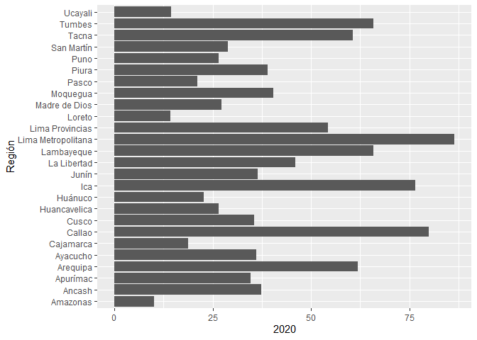<!-- -->

``` r
acceso_tic%>%
  ggplot(aes(y=Región, x=`2020`))+
  geom_col()+
  scale_y_discrete(limits = rev)+
  labs(x="(% del total)",
       caption="Fuente: Censo Educativo del Ministerio de Educación.", title="Perú: Porcentaje de escuelas primarias que cuentan con acceso a Internet\n según departamento, 2020")+
  theme_bw()+
  theme(axis.title.y = element_blank(),
        plot.title = element_text(hjust = 0.5, size=09),
        axis.text.y = element_text(size=08))
```

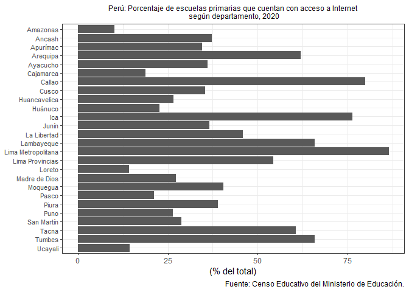<!-- -->

¿Cómo ordenar a modo ránking? Utilizamos la función
`reorder(Región,`2020`)` para que el eje y se ordene de mayor a menor.

``` r
acceso_tic%>%
  ggplot(aes(y=reorder(Región, `2020`), x=`2020`))+
  geom_col()+
  labs(x="(% del total)",caption="Fuente: Censo Educativo del Ministerio de Educación.", title="Perú: Porcentaje de escuelas primarias que cuentan con acceso a Internet\n según departamento, 2020")+
  theme_classic()+
  theme(axis.title.y = element_blank(),
        plot.title = element_text(hjust = 0.5, size=09),
        axis.text.y = element_text(size=08))
```

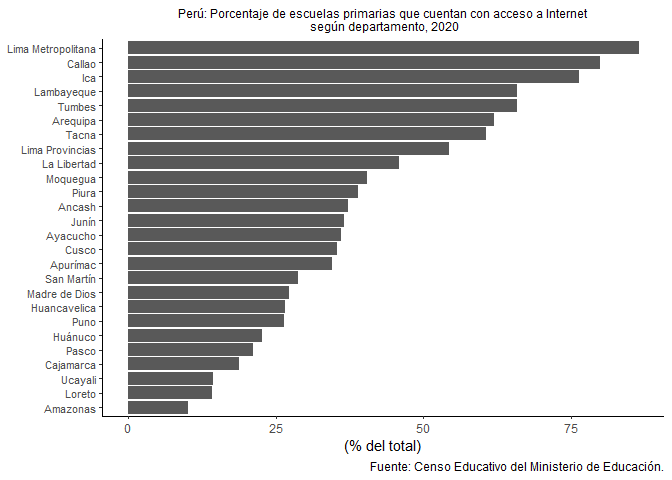<!-- -->

## Barras verticales

Utilizamos los mismos datos, pero a nivel nacional para el periodo
2016-2020. Con la opción `range` seleccionamos el rango de nuestro
interés.

``` r
peru_tic<-read_xls(paste0(td1,"/","acceso_internet.xls"), range = "B4:G5")
```

    ## New names:
    ## * `` -> ...1

``` r
names(peru_tic)<-c("Nivel", 2016:2020)
head(peru_tic)
```

    ## # A tibble: 1 x 6
    ##   Nivel `2016` `2017` `2018` `2019` `2020`
    ##   <chr>  <dbl>  <dbl>  <dbl>  <dbl>  <dbl>
    ## 1 PERÚ    38.4   37.9   40.4   49.1   40.4

¿Cómo realizar la visualización de la serie de datos? Con la función
`melt` realizamos el *unpivot* de los datos. La variable **Nivel** nos
sirve como el id para la serie larga de los datos.

``` r
peru_tic<-peru_tic%>%
  melt(vars.id="Nivel", variable.name="Periodo", value.name = "Ratio")%>%
  mutate(Periodo=as.character(Periodo))
```

    ## Using Nivel as id variables

``` r
peru_tic
```

    ##   Nivel Periodo    Ratio
    ## 1  PERÚ    2016 38.41605
    ## 2  PERÚ    2017 37.87741
    ## 3  PERÚ    2018 40.42873
    ## 4  PERÚ    2019 49.11799
    ## 5  PERÚ    2020 40.36604

Visualización de los datos en barra vertical como el anterior gráfico.

``` r
peru_tic%>%
  ggplot(aes(Periodo, Ratio, label=round(Ratio,1)))+
  geom_col()+geom_text()
```

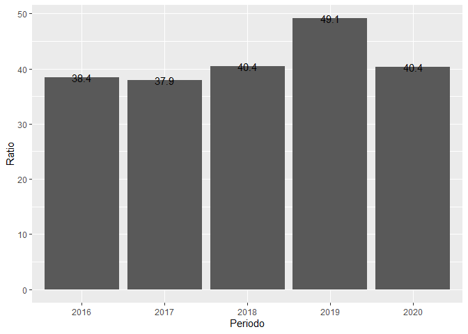<!-- -->

``` r
peru_tic%>%
  ggplot(aes(Periodo, Ratio, label=round(Ratio,1)))+
  geom_col()+
  labs(y="(% del total)", title="Perú: Porcentaje de escuelas primarias que cuentan con acceso a Internet", caption="Fuente: Censo Educativo del Ministerio de Educación.")+
  geom_text(vjust=-0.3, size=3)+
  theme_classic()+
  theme(axis.title.x = element_blank(), plot.title = element_text(hjust = 0.5, size=11))
```

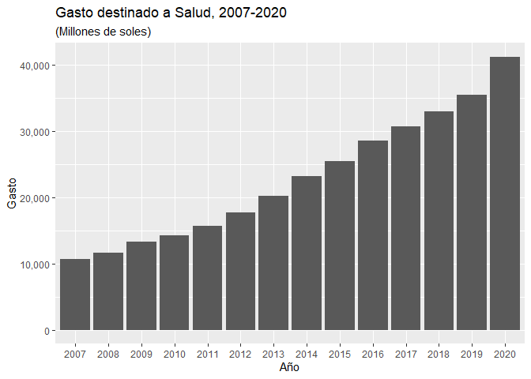<!-- -->

``` r
download.file( "https://www.inei.gob.pe/media/MenuRecursivo/indices_tematicos/1-gasto-en-salud.xlsx",destfile = paste0(td1,"/","gasto_salud.xlsx"), mode = "wb")
```

``` r
gasto_salud<-read_xlsx(paste0(td1,"/","gasto_salud.xlsx"), skip=5)%>%filter(Total!="")%>%select(-Total)%>%
  rename(Público=`Gasto en el Sector Salud`,Privado=...4)%>%
  mutate_at(vars(contains("P")),as.numeric)%>%
  melt(vars.id=c("Año"), variable.name="Tipo", value.name = "Gasto")%>%
  mutate(Año=substr(Año,1,4))
```

    ## New names:
    ## * `` -> ...4

    ## Using Año as id variables

``` r
head(gasto_salud)
```

    ##    Año    Tipo Gasto
    ## 1 2007 Público  5487
    ## 2 2008 Público  5998
    ## 3 2009 Público  7253
    ## 4 2010 Público  7715
    ## 5 2011 Público  8700
    ## 6 2012 Público 10023

``` r
gasto_salud%>%
  ggplot(aes(x=Año,y=Gasto))+
  geom_col()+
  labs(title = "Gasto destinado a Salud, 2007-2020",subtitle ="(Millones de soles)")+
  scale_y_continuous(labels=scales::comma)
```

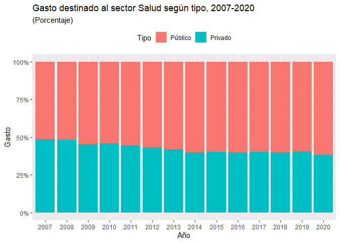<!-- -->

``` r
gasto_salud%>%
  ggplot(aes(x=Año,y=Gasto))+
  geom_col(aes(fill=Tipo))+
  labs(title = "Gasto destinado al sector Salud según tipo, 2007-2020",
       subtitle ="(Millones de soles)")+
  scale_y_continuous(labels=scales::comma)+theme(legend.position = "top")
```

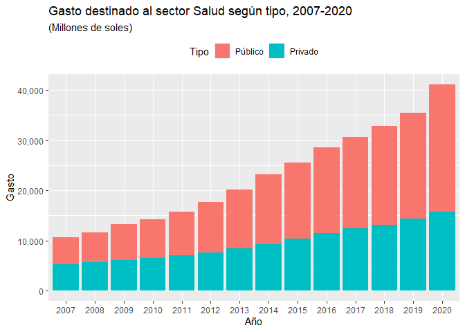<!-- -->

``` r
gasto_salud%>%
  ggplot(aes(x=Año,y=Gasto))+
  geom_col(aes(fill=Tipo), position = "dodge")+
  labs(title = "Gasto destinado al sector Salud según tipo, 2007-2020",
       subtitle ="(Millones de soles)")+
  scale_y_continuous(labels=scales::comma)+theme(legend.position = "top")
```

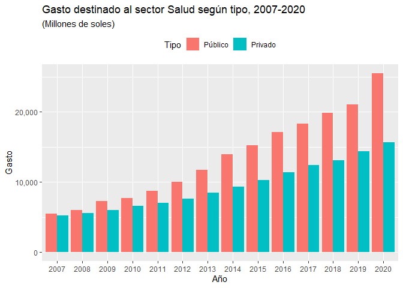<!-- -->

``` r
gasto_salud%>%
  ggplot(aes(x=Año,y=Gasto))+
  geom_col(aes(fill=Tipo),position = "fill")+
  labs(title = "Gasto destinado al sector Salud según tipo, 2007-2020",
       subtitle ="(Porcentaje)")+
  scale_y_continuous(labels=scales::percent)+theme_bw()+theme(legend.position = "top")
```

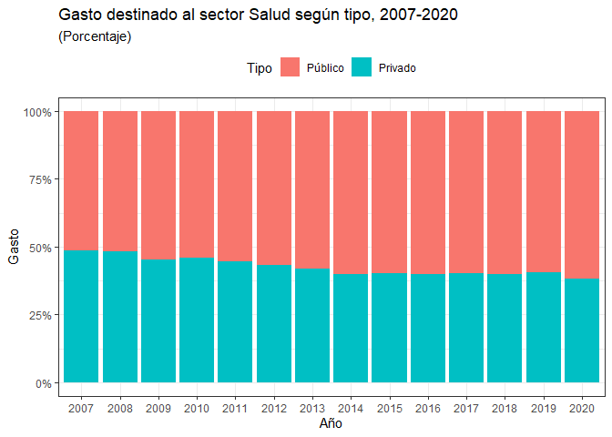<!-- -->

## Gráficos de dispersión

``` r
download.file( "https://www.inei.gob.pe/media/MenuRecursivo/indices_tematicos/5.15a_1.xlsx",destfile = paste0(td1,"/","matricula_prim.xlsx"), mode = "wb")
#Cargamos los datos
primaria<-read_xlsx(paste0(td1,"/","matricula_prim.xlsx"),skip=15)%>%filter(...2!="")
```

    ## New names:
    ## * `` -> ...2
    ## * `` -> ...3
    ## * `` -> ...4
    ## * `` -> ...5
    ## * `` -> ...6
    ## * ...

``` r
#Nombramos las columnas según año de interés
names(primaria)[2:14]<-c(2008:2020)
```

### Scatter plot

``` r
primaria%>%
  ggplot(aes(x=`2008`,y=`2020`))+
  geom_point()
```

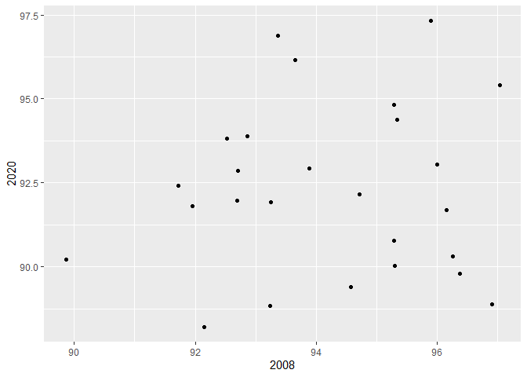<!-- -->

``` r
primaria%>%
  ggplot(aes(x=`2008`,y=`2020`))+
  geom_point()+
  xlim(85,100)+ylim(85,100)+
  labs(title="Perú: Tasa neta de matrícula escolar primaria, 2008-2020", subtitle = "(Porcentaje del total de la población de 6 a 11 años)", y="Tasa neta 2020",x="Tasa neta 2008")+
  geom_abline(slope = 1, col="blue")+
  annotate('text', x = 87, y = 95, label = 'Zona de resilencia')
```

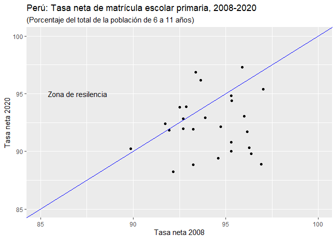<!-- -->

### Gráfico de cajas

``` r
primaria%>%
  melt(vars.id=c("Departamento"), variable.name="Periodo", value.name = "Matricula")
```

    ## Using Departamento as id variables

    ##                Departamento Periodo Matricula
    ## 1                  Amazonas    2008  93.23108
    ## 2                    Áncash    2008  95.28006
    ## 3                  Apurímac    2008  96.36735
    ## 4                  Arequipa    2008  95.33087
    ## 5                  Ayacucho    2008  93.24594
    ## 6                 Cajamarca    2008  92.70857
    ## 7   Prov. Const. del Callao    2008  96.25933
    ## 8                     Cusco    2008  95.89769
    ## 9              Huancavelica    2008  97.02664
    ## 10                  Huánuco    2008  93.37079
    ## 11                      Ica    2008  96.90782
    ## 12                    Junín    2008  94.71468
    ## 13              La Libertad    2008  91.95503
    ## 14               Lambayeque    2008  95.29033
    ## 15    Lima Metropolitana 1/    2008  94.57728
    ## 16  Departamento de Lima 2/    2008  92.15308
    ## 17                   Loreto    2008  92.68886
    ## 18            Madre de Dios    2008  96.15145
    ## 19                 Moquegua    2008  95.28647
    ## 20                    Pasco    2008  92.51728
    ## 21                    Piura    2008  91.71657
    ## 22                     Puno    2008  93.65556
    ## 23               San Martín    2008  93.88312
    ## 24                    Tacna    2008  92.86441
    ## 25                   Tumbes    2008  95.99586
    ## 26                  Ucayali    2008  89.86357
    ## 27                 Amazonas    2009  95.95268
    ## 28                   Áncash    2009  93.81634
    ## 29                 Apurímac    2009  93.67077
    ## 30                 Arequipa    2009  93.69839
    ## 31                 Ayacucho    2009  94.08183
    ## 32                Cajamarca    2009  95.82963
    ## 33  Prov. Const. del Callao    2009  92.51413
    ## 34                    Cusco    2009  94.78708
    ## 35             Huancavelica    2009  96.30643
    ## 36                  Huánuco    2009  94.34303
    ## 37                      Ica    2009  96.64007
    ## 38                    Junín    2009  93.94660
    ## 39              La Libertad    2009  91.85454
    ## 40               Lambayeque    2009  93.00704
    ## 41    Lima Metropolitana 1/    2009  94.01860
    ## 42  Departamento de Lima 2/    2009  96.32291
    ## 43                   Loreto    2009  93.83461
    ## 44            Madre de Dios    2009  94.48892
    ## 45                 Moquegua    2009  93.97341
    ## 46                    Pasco    2009  97.56996
    ## 47                    Piura    2009  95.29638
    ## 48                     Puno    2009  94.55634
    ## 49               San Martín    2009  96.47090
    ## 50                    Tacna    2009  91.35147
    ## 51                   Tumbes    2009  95.98397
    ## 52                  Ucayali    2009  92.99585
    ## 53                 Amazonas    2010  95.00655
    ## 54                   Áncash    2010  95.26802
    ## 55                 Apurímac    2010  92.33463
    ## 56                 Arequipa    2010  94.42282
    ## 57                 Ayacucho    2010  92.63532
    ## 58                Cajamarca    2010  93.71131
    ## 59  Prov. Const. del Callao    2010  95.71039
    ## 60                    Cusco    2010  95.50009
    ## 61             Huancavelica    2010  95.94281
    ## 62                  Huánuco    2010  94.04926
    ## 63                      Ica    2010  92.44827
    ## 64                    Junín    2010  94.74967
    ## 65              La Libertad    2010  95.40284
    ## 66               Lambayeque    2010  95.89476
    ## 67    Lima Metropolitana 1/    2010  92.56589
    ## 68  Departamento de Lima 2/    2010  95.97467
    ## 69                   Loreto    2010  93.75267
    ## 70            Madre de Dios    2010  94.42527
    ## 71                 Moquegua    2010  95.54633
    ## 72                    Pasco    2010  92.59254
    ## 73                    Piura    2010  91.78043
    ## 74                     Puno    2010  90.28767
    ## 75               San Martín    2010  96.19938
    ## 76                    Tacna    2010  96.40946
    ## 77                   Tumbes    2010  94.72757
    ## 78                  Ucayali    2010  93.59193
    ## 79                 Amazonas    2011  90.77226
    ## 80                   Áncash    2011  95.83720
    ## 81                 Apurímac    2011  96.65748
    ## 82                 Arequipa    2011  95.19601
    ## 83                 Ayacucho    2011  93.92565
    ## 84                Cajamarca    2011  95.25724
    ## 85  Prov. Const. del Callao    2011  94.98986
    ## 86                    Cusco    2011  94.74188
    ## 87             Huancavelica    2011  96.01032
    ## 88                  Huánuco    2011  94.26553
    ## 89                      Ica    2011  94.07254
    ## 90                    Junín    2011  90.97342
    ## 91              La Libertad    2011  90.92930
    ## 92               Lambayeque    2011  95.64742
    ## 93    Lima Metropolitana 1/    2011  92.81077
    ## 94  Departamento de Lima 2/    2011  93.52154
    ## 95                   Loreto    2011  93.31213
    ## 96            Madre de Dios    2011  92.63277
    ## 97                 Moquegua    2011  94.42906
    ## 98                    Pasco    2011  92.79758
    ## 99                    Piura    2011  91.59330
    ## 100                    Puno    2011  94.93950
    ## 101              San Martín    2011  93.87022
    ## 102                   Tacna    2011  94.28127
    ## 103                  Tumbes    2011  95.54775
    ## 104                 Ucayali    2011  93.16526
    ## 105                Amazonas    2012  94.67745
    ## 106                  Áncash    2012  95.19213
    ## 107                Apurímac    2012  91.83081
    ## 108                Arequipa    2012  93.90463
    ## 109                Ayacucho    2012  94.26379
    ## 110               Cajamarca    2012  96.01518
    ## 111 Prov. Const. del Callao    2012  91.96916
    ## 112                   Cusco    2012  93.83357
    ## 113            Huancavelica    2012  92.73939
    ## 114                 Huánuco    2012  93.64669
    ## 115                     Ica    2012  93.64705
    ## 116                   Junín    2012  90.96504
    ## 117             La Libertad    2012  92.79725
    ## 118              Lambayeque    2012  93.85771
    ## 119   Lima Metropolitana 1/    2012  91.22277
    ## 120 Departamento de Lima 2/    2012  95.40461
    ## 121                  Loreto    2012  91.19406
    ## 122           Madre de Dios    2012  93.64218
    ## 123                Moquegua    2012  95.36856
    ## 124                   Pasco    2012  94.38111
    ## 125                   Piura    2012  93.16598
    ## 126                    Puno    2012  91.01509
    ## 127              San Martín    2012  93.75134
    ## 128                   Tacna    2012  94.79525
    ## 129                  Tumbes    2012  96.51980
    ## 130                 Ucayali    2012  91.93399
    ## 131                Amazonas    2013  93.62029
    ## 132                  Áncash    2013  94.01750
    ## 133                Apurímac    2013  91.20323
    ## 134                Arequipa    2013  93.67909
    ## 135                Ayacucho    2013  94.46614
    ## 136               Cajamarca    2013  93.16500
    ## 137 Prov. Const. del Callao    2013  93.02282
    ## 138                   Cusco    2013  91.81312
    ## 139            Huancavelica    2013  94.08422
    ## 140                 Huánuco    2013  95.43145
    ## 141                     Ica    2013  93.45096
    ## 142                   Junín    2013  90.66846
    ## 143             La Libertad    2013  91.18480
    ## 144              Lambayeque    2013  94.34455
    ## 145   Lima Metropolitana 1/    2013  92.38327
    ## 146 Departamento de Lima 2/    2013  94.62033
    ## 147                  Loreto    2013  91.31867
    ## 148           Madre de Dios    2013  93.88452
    ## 149                Moquegua    2013  95.65745
    ## 150                   Pasco    2013  93.70471
    ## 151                   Piura    2013  93.55450
    ## 152                    Puno    2013  91.09551
    ## 153              San Martín    2013  92.98164
    ## 154                   Tacna    2013  94.29015
    ## 155                  Tumbes    2013  93.59516
    ## 156                 Ucayali    2013  87.31401
    ## 157                Amazonas    2014  91.18076
    ## 158                  Áncash    2014  91.71182
    ## 159                Apurímac    2014  93.38687
    ## 160                Arequipa    2014  91.86414
    ## 161                Ayacucho    2014  88.05297
    ## 162               Cajamarca    2014  93.40816
    ## 163 Prov. Const. del Callao    2014  88.64993
    ## 164                   Cusco    2014  91.49229
    ## 165            Huancavelica    2014  94.57100
    ## 166                 Huánuco    2014  93.13195
    ## 167                     Ica    2014  93.80353
    ## 168                   Junín    2014  93.28270
    ## 169             La Libertad    2014  95.05367
    ## 170              Lambayeque    2014  91.56058
    ## 171   Lima Metropolitana 1/    2014  91.64413
    ## 172 Departamento de Lima 2/    2014  94.56292
    ## 173                  Loreto    2014  91.91480
    ## 174           Madre de Dios    2014  91.94859
    ## 175                Moquegua    2014  91.13621
    ## 176                   Pasco    2014  94.48584
    ## 177                   Piura    2014  91.11555
    ## 178                    Puno    2014  91.83494
    ## 179              San Martín    2014  93.38431
    ## 180                   Tacna    2014  93.00871
    ## 181                  Tumbes    2014  91.63775
    ## 182                 Ucayali    2014  88.44901
    ## 183                Amazonas    2015  95.69007
    ## 184                  Áncash    2015  92.08454
    ## 185                Apurímac    2015  88.41345
    ## 186                Arequipa    2015  89.36949
    ## 187                Ayacucho    2015  93.80228
    ## 188               Cajamarca    2015  93.18594
    ## 189 Prov. Const. del Callao    2015  91.20175
    ## 190                   Cusco    2015  91.51884
    ## 191            Huancavelica    2015  92.19530
    ## 192                 Huánuco    2015  93.34779
    ## 193                     Ica    2015  92.77744
    ## 194                   Junín    2015  91.43186
    ## 195             La Libertad    2015  92.63818
    ## 196              Lambayeque    2015  89.80562
    ## 197   Lima Metropolitana 1/    2015  90.05221
    ## 198 Departamento de Lima 2/    2015  90.35439
    ## 199                  Loreto    2015  92.36399
    ## 200           Madre de Dios    2015  91.88741
    ## 201                Moquegua    2015  94.57977
    ## 202                   Pasco    2015  94.85392
    ## 203                   Piura    2015  92.42915
    ## 204                    Puno    2015  91.81698
    ## 205              San Martín    2015  91.65656
    ## 206                   Tacna    2015  92.12276
    ## 207                  Tumbes    2015  90.88169
    ## 208                 Ucayali    2015  87.09293
    ## 209                Amazonas    2016  92.00705
    ## 210                  Áncash    2016  91.10708
    ## 211                Apurímac    2016  94.42985
    ## 212                Arequipa    2016  94.09141
    ## 213                Ayacucho    2016  89.97872
    ## 214               Cajamarca    2016  92.63506
    ## 215 Prov. Const. del Callao    2016  89.65758
    ## 216                   Cusco    2016  92.43123
    ## 217            Huancavelica    2016  92.26826
    ## 218                 Huánuco    2016  92.96742
    ## 219                     Ica    2016  91.97223
    ## 220                   Junín    2016  90.49744
    ## 221             La Libertad    2016  91.73352
    ## 222              Lambayeque    2016  89.96995
    ## 223   Lima Metropolitana 1/    2016  89.82339
    ## 224 Departamento de Lima 2/    2016  92.30764
    ## 225                  Loreto    2016  90.39256
    ## 226           Madre de Dios    2016  92.97476
    ## 227                Moquegua    2016  93.32044
    ## 228                   Pasco    2016  94.90261
    ## 229                   Piura    2016  90.29245
    ## 230                    Puno    2016  93.82177
    ## 231              San Martín    2016  94.16622
    ## 232                   Tacna    2016  94.28341
    ## 233                  Tumbes    2016  92.14703
    ## 234                 Ucayali    2016  92.70691
    ## 235                Amazonas    2017  92.15681
    ## 236                  Áncash    2017  92.94194
    ## 237                Apurímac    2017  92.40210
    ## 238                Arequipa    2017  92.84505
    ## 239                Ayacucho    2017  94.00812
    ## 240               Cajamarca    2017  93.64244
    ## 241 Prov. Const. del Callao    2017  90.35741
    ## 242                   Cusco    2017  93.60814
    ## 243            Huancavelica    2017  92.09248
    ## 244                 Huánuco    2017  93.49692
    ## 245                     Ica    2017  89.87032
    ## 246                   Junín    2017  91.40918
    ## 247             La Libertad    2017  91.70994
    ## 248              Lambayeque    2017  91.11175
    ## 249   Lima Metropolitana 1/    2017  92.53486
    ## 250 Departamento de Lima 2/    2017  93.52575
    ## 251                  Loreto    2017  90.53439
    ## 252           Madre de Dios    2017  91.04463
    ## 253                Moquegua    2017  91.71264
    ## 254                   Pasco    2017  92.58680
    ## 255                   Piura    2017  91.91289
    ## 256                    Puno    2017  88.53099
    ## 257              San Martín    2017  93.91369
    ## 258                   Tacna    2017  95.53797
    ## 259                  Tumbes    2017  90.06352
    ## 260                 Ucayali    2017  90.97326
    ## 261                Amazonas    2018  92.81495
    ## 262                  Áncash    2018  93.75679
    ## 263                Apurímac    2018  96.42040
    ## 264                Arequipa    2018  93.80402
    ## 265                Ayacucho    2018  94.02832
    ## 266               Cajamarca    2018  92.99303
    ## 267 Prov. Const. del Callao    2018  92.08704
    ## 268                   Cusco    2018  93.03633
    ## 269            Huancavelica    2018  94.19928
    ## 270                 Huánuco    2018  92.55370
    ## 271                     Ica    2018  92.24708
    ## 272                   Junín    2018  94.03258
    ## 273             La Libertad    2018  92.64523
    ## 274              Lambayeque    2018  91.98966
    ## 275   Lima Metropolitana 1/    2018  93.96172
    ## 276 Departamento de Lima 2/    2018  93.66130
    ## 277                  Loreto    2018  93.41096
    ## 278           Madre de Dios    2018  94.15513
    ## 279                Moquegua    2018  92.14981
    ## 280                   Pasco    2018  94.68591
    ## 281                   Piura    2018  92.86008
    ## 282                    Puno    2018  95.77901
    ## 283              San Martín    2018  93.10126
    ## 284                   Tacna    2018  95.66121
    ## 285                  Tumbes    2018  94.18550
    ## 286                 Ucayali    2018  92.02087
    ## 287                Amazonas    2019  91.81936
    ## 288                  Áncash    2019  93.65741
    ## 289                Apurímac    2019  97.33233
    ## 290                Arequipa    2019  94.10289
    ## 291                Ayacucho    2019  93.19087
    ## 292               Cajamarca    2019  94.82186
    ## 293 Prov. Const. del Callao    2019  92.89280
    ## 294                   Cusco    2019  96.10614
    ## 295            Huancavelica    2019  91.99074
    ## 296                 Huánuco    2019  91.86393
    ## 297                     Ica    2019  95.78810
    ## 298                   Junín    2019  89.95088
    ## 299             La Libertad    2019  93.78311
    ## 300              Lambayeque    2019  93.09406
    ## 301   Lima Metropolitana 1/    2019  93.48684
    ## 302 Departamento de Lima 2/    2019  92.56648
    ## 303                  Loreto    2019  94.65201
    ## 304           Madre de Dios    2019  95.58623
    ## 305                Moquegua    2019  93.57414
    ## 306                   Pasco    2019  95.64893
    ## 307                   Piura    2019  94.66772
    ## 308                    Puno    2019  94.57737
    ## 309              San Martín    2019  93.41533
    ## 310                   Tacna    2019  95.41363
    ## 311                  Tumbes    2019  97.51467
    ## 312                 Ucayali    2019  93.67371
    ## 313                Amazonas    2020  88.84525
    ## 314                  Áncash    2020  94.83373
    ## 315                Apurímac    2020  89.78662
    ## 316                Arequipa    2020  94.37848
    ## 317                Ayacucho    2020  91.93334
    ## 318               Cajamarca    2020  92.84934
    ## 319 Prov. Const. del Callao    2020  90.31199
    ## 320                   Cusco    2020  97.32018
    ## 321            Huancavelica    2020  95.40484
    ## 322                 Huánuco    2020  96.88591
    ## 323                     Ica    2020  88.87934
    ## 324                   Junín    2020  92.15680
    ## 325             La Libertad    2020  91.81704
    ## 326              Lambayeque    2020  90.02875
    ## 327   Lima Metropolitana 1/    2020  89.39304
    ## 328 Departamento de Lima 2/    2020  88.21888
    ## 329                  Loreto    2020  91.97024
    ## 330           Madre de Dios    2020  91.68781
    ## 331                Moquegua    2020  90.77572
    ## 332                   Pasco    2020  93.81313
    ## 333                   Piura    2020  92.41976
    ## 334                    Puno    2020  96.15460
    ## 335              San Martín    2020  92.92014
    ## 336                   Tacna    2020  93.89564
    ## 337                  Tumbes    2020  93.05584
    ## 338                 Ucayali    2020  90.21197

``` r
primaria%>%
  melt(vars.id=c("Departamento"), variable.name="Periodo", value.name = "Matricula")%>%
  ggplot(aes(y=Periodo,x=Matricula))+
  geom_boxplot()+
  labs(title="Heterogeneidad regional de tasa neta de matrícula escolar", subtitle = "(Porcentaje del total de la población de 6 a 11 años)", x="Tasa neta de matrícula escolar primaria")+
  theme(axis.title.y = element_blank())
```

    ## Using Departamento as id variables

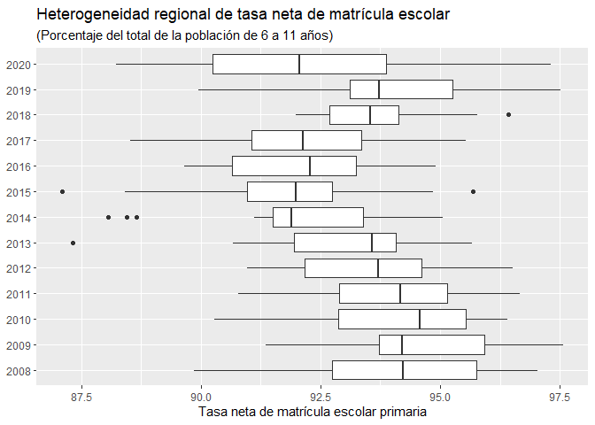<!-- -->

``` r
tf1 <- tempfile()
td1<-tempdir()
download.file("https://www.datosabiertos.gob.pe/sites/default/files/Bono600_DU_010_2021.zip", tf1)
archive(tf1)
```

    ## # A tibble: 1 x 3
    ##   path                         size date               
    ##   <chr>                       <int> <dttm>             
    ## 1 Bono600_DU_010_2021.txt 459701023 2021-02-25 11:27:26

``` r
bono600<-read_delim(archive_read(tf1, file = "Bono600_DU_010_2021.txt"), 
                    delim = "|")
```

    ## 
    ## -- Column specification --------------------------------------------------------
    ## cols(
    ##   CODIGO_HOGAR = col_double(),
    ##   DEPARTAMENTO = col_character(),
    ##   PROVINCIA = col_character(),
    ##   DISTRITO = col_character(),
    ##   AREA = col_double(),
    ##   NU_PERSONA = col_character(),
    ##   GENERO = col_double(),
    ##   EDAD = col_double()
    ## )

    ## Warning: 1110 parsing failures.
    ##   row  col expected actual         file
    ## 21595 AREA a double     ND <connection>
    ## 24187 AREA a double     ND <connection>
    ## 33102 AREA a double     ND <connection>
    ## 43485 AREA a double     ND <connection>
    ## 70551 AREA a double     ND <connection>
    ## ..... .... ........ ...... ............
    ## See problems(...) for more details.

``` r
bono600<-bono600%>%
  mutate(AREA=if_else(AREA==1,"Urbano",
                      if_else(AREA==2,"Rural",NULL)),
         GENERO=if_else(GENERO==1,"Masculino",
                        if_else(GENERO==2,"Femenino",NULL)))
```

``` r
bono600%>%
  ggplot()+
  geom_bar(aes(y=DEPARTAMENTO))+
  scale_x_continuous(labels = scales::label_number_si())+
  scale_y_discrete(limits=rev)+
  labs(y=element_blank(),x="Personas asignadas", title = "Distribución del padrón de `Bono 600` por región", subtitle = "(Millones de beneficiarios)")
```

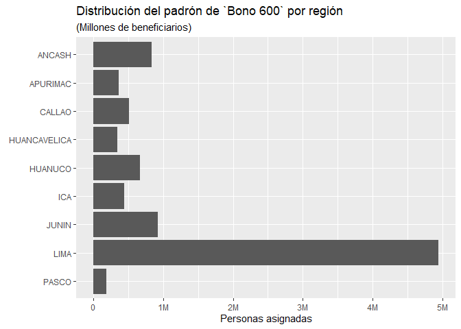<!-- -->

``` r
bono600%>%
  ggplot()+
  geom_bar(aes(y=DEPARTAMENTO))+
  scale_x_continuous(labels = scales::label_number_si())+
  scale_y_discrete(limits=rev)+
  labs(y=element_blank(),x="Personas asignadas", title = "Distribución del padrón de `Bono 600` por región", subtitle = "(Millones de beneficiarios)")
```

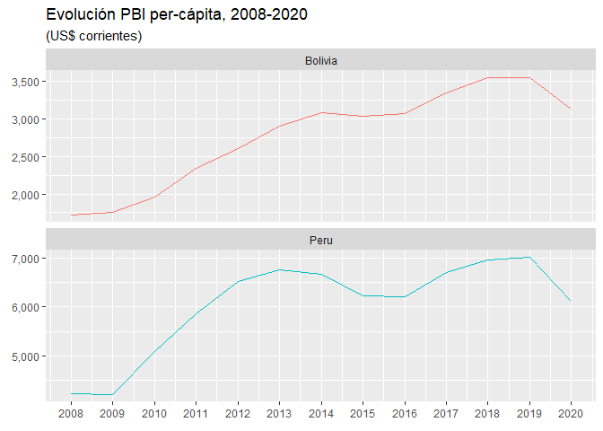<!-- -->

``` r
bono600%>%
  filter(DEPARTAMENTO=="LIMA", AREA!="")%>%
  ggplot(aes(EDAD,colour=as.factor(AREA),after_stat(density))) +
  geom_freqpoly()+
  scale_color_hue(name="Área", labels = c("Urbano","Rural"))+
  labs(y=element_blank(),x="Personas asignadas", title = "Distribución del padrón de `Bono 600` según edad", subtitle = "Departamento de Lima")
```

    ## `stat_bin()` using `bins = 30`. Pick better value with `binwidth`.

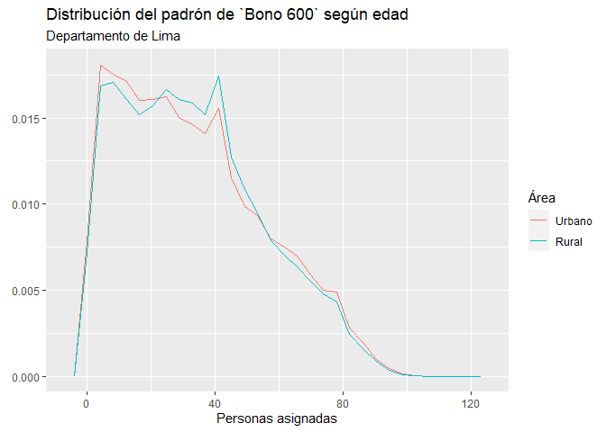<!-- -->

``` r
bono600%>%
  group_by(EDAD)%>%
  count(EDAD)
```

    ## # A tibble: 121 x 2
    ## # Groups:   EDAD [121]
    ##     EDAD      n
    ##    <dbl>  <int>
    ##  1     0   4605
    ##  2     1 132748
    ##  3     2 152203
    ##  4     3 159331
    ##  5     4 163913
    ##  6     5 167209
    ##  7     6 174201
    ##  8     7 173646
    ##  9     8 165932
    ## 10     9 163185
    ## # ... with 111 more rows

``` r
bono600%>%
  group_by(EDAD)%>%
  count(EDAD)%>%
  ungroup()%>%
  mutate(total=cumsum(n),total2=total/sum(n))%>%
  ggplot(aes(x=EDAD,y=total2))+
  geom_area()+
  scale_y_continuous(labels=scales::percent)+
  labs(title="Bono 600: Distribución acumulada según edad",
       subtitle = "(Porcentaje acumulado)",
       y=element_blank(),
       x=element_blank())
```

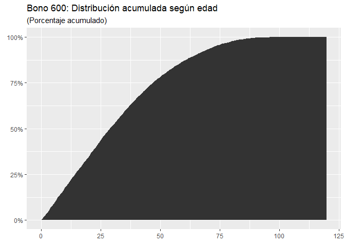<!-- -->

``` r
bono600 %>% 
  group_by(GENERO)%>%
  count(GENERO)
```

    ## # A tibble: 2 x 2
    ## # Groups:   GENERO [2]
    ##   GENERO          n
    ##   <chr>       <int>
    ## 1 Femenino  4725610
    ## 2 Masculino 4483015

``` r
bono600 %>% 
  group_by(GENERO)%>%
  count(GENERO)%>%
  ungroup()%>%
  arrange(desc(GENERO)) %>%
  mutate(prop = n / sum(n) *100) %>%
  mutate(ypos = cumsum(prop)- 0.5*prop )%>%
  ggplot(aes(x="", y=prop, fill=GENERO)) +
  geom_bar(stat="identity", width=1, color="white") +
  coord_polar("y", start=0) +
  theme_void() + 
  labs(title="Bono 600: Distibución segúx sexo",
       subtitle = "(Porcentaje)",
       fill=element_blank())+
  theme(legend.position="bottom") +
  geom_text(aes(y = ypos, label = round(prop,1)), color = "white", size=6)
```

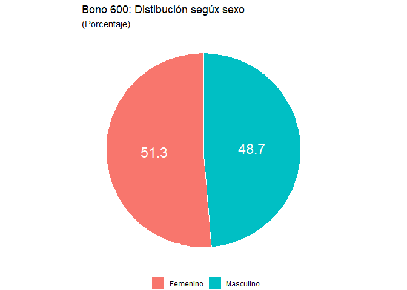<!-- -->

## Gráficos de línea

``` r
#install.packages("wbstats")
library(wbstats)
```

    ## Warning: package 'wbstats' was built under R version 4.0.5

``` r
d_wb <- wb_data(c(gdp_capita ="NY.GDP.PCAP.CD"),
                start_date = 2008, end_date = 2020,
             country = c("Peru","Bolivia"))
```

``` r
d_wb%>%
  ggplot(aes(x=date,gdp_capita,col=country, shape=country))+
  geom_line()
```

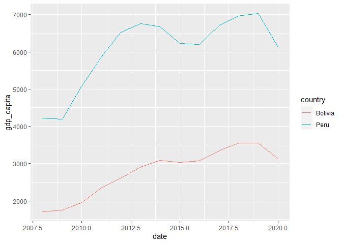<!-- -->

``` r
d_wb%>%
  ggplot(aes(x=date,gdp_capita,col=country, shape=country))+
  geom_line()+
  geom_point()+
  scale_y_continuous(labels =scales::comma)+
  scale_x_continuous(breaks= seq(from = 2008, to =2020, by = 1))+
  theme_bw()+
  theme(legend.position = "top", legend.title =element_blank())+
  labs(y=element_blank(),x=element_blank(),title = "Evolución PBI per-cápita, 2008-2020",subtitle = "(US$ corrientes)")
```

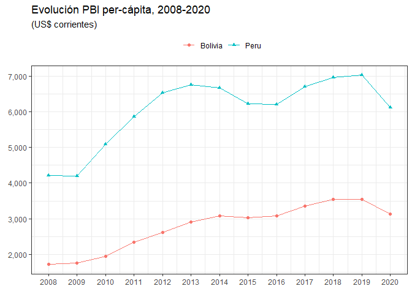<!-- -->

``` r
d_wb%>%
  ggplot(aes(x=date,gdp_capita,col=country, shape=country))+
  geom_line()+
  scale_y_continuous(labels =scales::comma)+
  scale_x_continuous(breaks= seq(from = 2008, to =2020, by = 1))+
  labs(y=element_blank(),x=element_blank(),title = "Evolución PBI per-cápita, 2008-2020",subtitle = "(US$ corrientes)")+
  facet_wrap(~country, ncol=2, scales="free_y")+
  theme(legend.position = "none", axis.text.x = element_text(size=08, angle=90))
```

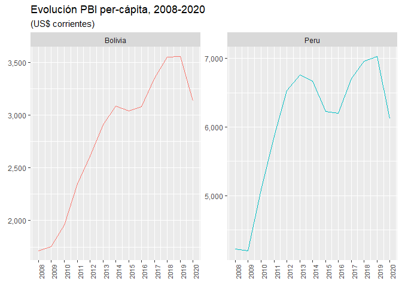<!-- -->

``` r
d_wb%>%
  ggplot(aes(x=date,gdp_capita,col=country, shape=country))+
  geom_line()+
  scale_y_continuous(labels =scales::comma)+
  scale_x_continuous(breaks= seq(from = 2008, to =2020, by = 1))+
  facet_wrap(~country, ncol = 1, scales = "free_y") +
  theme(legend.position = "none")+
  labs(y=element_blank(),x=element_blank(),title = "Evolución PBI per-cápita, 2008-2020",subtitle = "(US$ corrientes)")
```

<!-- -->
